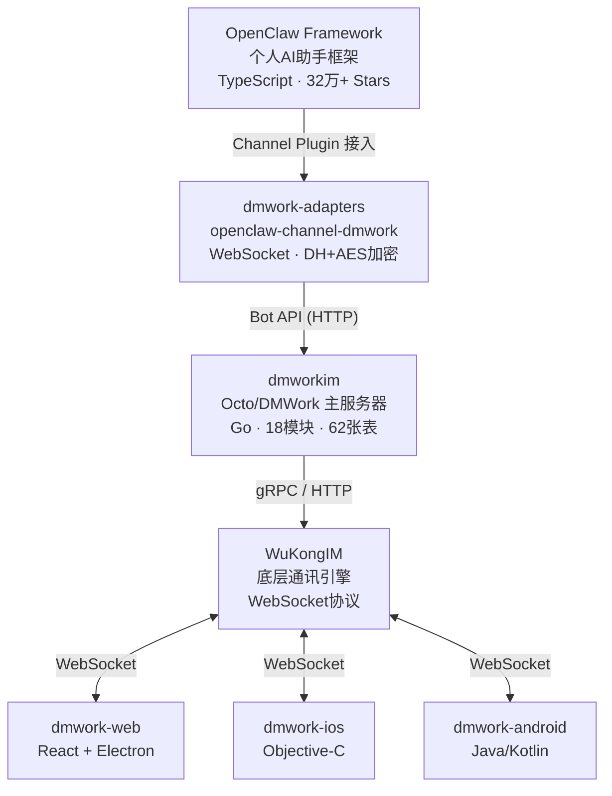

# 愿景与定位

> Octo 是为 AI Agent 时代而生的即时通讯平台，OpenClaw 是让 AI 助手无处不在的个人框架。

## 概述

Octo（即 DMWork）是一个**面向 AI Agent 时代的企业即时通讯平台**，原生支持人与 AI Bot 的无缝协作。OpenClaw 是一个**个人 AI 助手框架**，让你在任何 IM 渠道上都能触达自己的私有 AI 助手。

两者通过 **Channel Plugin 机制**深度整合：OpenClaw 将 Octo/DMWork 作为 20+ 支持渠道之一，AI Agent 可以像回复普通消息一样回复 Octo 用户的消息。

---

## 产品定位

### Octo / DMWork — AI Agent 时代的 IM 平台

**一句话定位**：AI Agent 时代的即时通讯平台 — 连接人与 AI，让协作更高效。

登录页 slogan 直接体现了这个愿景。Octo 的核心价值不是替代现有 IM，而是在 IM 的基础上原生集成 AI Agent 能力：

- **双层架构**：业务层（dmworkim）专注 IM 业务逻辑，通讯层（WuKongIM）专注高性能消息投递
- **Bot 原生支持**：BotFather + Robot 双模块，AI Agent 是一等公民，不是事后附加的功能
- **Space 多租户**：企业级空间隔离，不同团队/组织各自独立
- **多端覆盖**：Web/Electron、iOS、Android 全平台

```
登录页 slogan:
"AI Agent 时代的即时通讯平台 — 连接人与 AI，让协作更高效。"
```

### OpenClaw — 个人 AI 助手框架

**一句话定位**：你的私有 AI 助手，多渠道触达，你的设备，你的数据。

> "The product is the assistant, Gateway is just the control plane."

OpenClaw 最核心的设计哲学：Gateway 不是产品，只是基础设施控制面。真正的产品是助手本身——它的人格（`SOUL.md`）、记忆（`MEMORY.md`）、工作方式（`AGENTS.md`）。

| 特征 | 说明 |
|------|------|
| 本地优先 | Gateway 跑在你自己的设备上，数据不过第三方 |
| 多渠道统一 | 20+ IM 渠道通过 Channel 抽象统一接入 |
| 可扩展 | Plugin 系统支持渠道、模型、记忆后端的插件化 |
| 多 Agent | 一个 Gateway 运行多个不同人格的 AI 助手 |

---

## 两者关系



**层次关系一句话总结**：
- **OpenClaw** 是框架（Framework）——定义了 AI 助手的接口和生命周期
- **DMWork/Octo** 是平台（Platform）——提供 IM 基础设施和用户群
- **dmwork-adapters** 是桥梁（Bridge）——实现了 OpenClaw 的 `ChannelPlugin` 接口，把两者连起来

---

## 核心设计哲学对比

| 维度 | Octo/DMWork | OpenClaw |
|------|-------------|----------|
| 目标用户 | 企业/团队（IM 平台） | 个人（AI 助手） |
| 核心价值 | 人与 Bot 协作的 IM 基础设施 | 私有 AI 助手随处可达 |
| 部署模式 | 服务端 + 客户端 | 个人 Gateway 本地运行 |
| Bot 模型 | Bot = 特殊用户（robot=1） | Agent = 有 SOUL.md 的 AI |
| 多租户 | Space 隔离（s{id}_ 前缀） | 多 Agent 隔离（独立 workspace） |
| 扩展方式 | Go 模块自注册 | TypeScript Plugin 系统 |

---

## 项目全景（7 个仓库）

| 项目 | 语言 | 定位 |
|------|------|------|
| OpenClaw | TypeScript | 个人 AI 助手框架 |
| dmworkim | Go | Octo IM 主服务器 |
| dmwork-lib | Go | Go 核心基础库 |
| dmwork-adapters | TypeScript | AI 适配层（OpenClaw ↔ DMWork） |
| dmwork-web | React+TS | Web/PC 客户端 |
| dmwork-ios | Objective-C | iOS 客户端 |
| dmwork-android | Java/Kotlin | Android 客户端 |

---

## 相关页面

- [[用户角色与场景]] — 谁在用，怎么用
- [[术语表]] — 专业术语速查
- [[路线图]] — 当前开发方向
- [[架构概述]] — 技术架构全景
- [[Bot系统]] — AI Agent 接入机制
- [[Space多租户]] — 企业级隔离方案

---

## CHANGELOG

| 版本 | 日期 | 变更说明 |
|------|------|----------|
| 0.1.0 | 2026-03-19 | 初始版本，按标准规范重组 |
