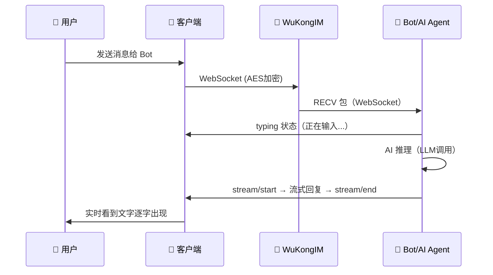

# 用户角色与场景

> Octo 服务于四类角色：IM 使用者、Bot 开发者、平台管理员和 OpenClaw 用户，每类角色都有独特的使用场景。

## 概述

理解谁在用 Octo/OpenClaw，以及他们怎么用，是理解产品设计决策的基础。

---

## 用户角色

### 角色 1：最终用户（IM 使用者）

**是谁**：使用 DMWork Web/iOS/Android 客户端进行日常通讯的人。

**核心需求**：
- 与同事/朋友即时聊天（文字、图片、文件、语音）
- 加入 Space（工作空间），组织群聊和频道
- 与 AI Bot 对话，获得智能助手服务
- 多端同步（Web、iOS、Android、桌面端）

**痛点与期望**：
- 希望 AI Bot 响应速度快、能看到打字中的状态
- 群聊中通过 @Bot 触发 AI，不干扰其他人
- 历史消息可同步，不丢失上下文

---

### 角色 2：Bot 开发者（AI 接入者）

**是谁**：将 AI 服务接入 Octo 平台的开发者，可能使用 OpenClaw 框架，也可能直接调用 Bot API。

**核心需求**：
- 简单地注册 Bot，获取 Token（`bf_` 前缀）
- 通过 HTTP API 接收消息事件、发送回复
- 支持流式输出（stream/start → sendMessage → stream/end）
- 获取群组成员信息，处理 @mention

**开发工具**：
- BotFather 模块：`/v1/bot/register`、`/v1/bot/sendMessage`、`/v1/bot/stream/*`
- 使用 OpenClaw + dmwork-adapters：零代码接入，自动处理 DH+AES 加密、流式消息、@mention 解析

**典型工作流**：
```
1. 在 Octo 中联系 @BotFather
2. 发送 /newbot → 获取 Bot Token（bf_xxx）
3. 调用 POST /v1/bot/register 注册，获取 IM Token
4. 建立 WebSocket 连接到 WuKongIM，接收消息
5. 调用 POST /v1/bot/sendMessage 或 stream API 回复
```

---

### 角色 3：平台管理员

**是谁**：负责部署和运维 Octo 平台的技术人员。

**核心需求**：
- Docker Compose 一键部署（WuKongIM + dmworkim + MySQL + Redis + MinIO + Web）
- 管理用户（封禁/解封）、群组（封禁/解散）
- 配置推送服务（APNs、Firebase、MI、HMS、VIVO、OPPO）
- 监控平台健康状态（`/v1/health`）
- 管理 App 配置、版本发布

**管理 API 前缀**：`/v1/manager/` 系列端点

---

### 角色 4：OpenClaw 用户（个人 AI 助手用户）

**是谁**：部署了 OpenClaw，将 DMWork 作为一个 IM 渠道来触达 AI 助手的用户。

**核心需求**：
- 在 Octo/DMWork 中直接和自己的 AI 助手（如"戏精"）对话
- AI 助手有记忆（MEMORY.md）、有人格（SOUL.md）
- 支持工具调用（代码执行、文件读写、网络搜索）
- AI 助手能主动联系自己（心跳任务）

**与角色 2 的区别**：
- Bot 开发者关注 API 集成，OpenClaw 用户关注 AI 助手体验
- OpenClaw 框架帮 OpenClaw 用户处理了所有底层协议

---

## 核心使用场景

### 场景 A：人与人聊天（DM + 群聊）

最基础的 IM 场景，Octo 在这里与 Slack、微信企业版等竞品竞争。

**DM（私聊）流程**：
```
用户A → WuKongIM（WebSocket + AES-CBC加密）→ 用户B
                     ↑
               消息持久化（MySQL）
               未读计数（Redis）
```

**群聊流程**：
```
用户A → WuKongIM → 广播给所有群成员
         ↓
    dmworkim 监听（robotMessageListen）
         ↓
    识别是否有 @Bot → 触发 Bot 事件
```

**三端支持**：

| 端 | 技术 | 特色 |
|----|------|------|
| Web | React + TypeScript | 流式 AI 消息渲染，Electron 桌面端 |
| iOS | Objective-C | Signal 端到端加密，APNs 推送 |
| Android | Java/Kotlin | 6 厂商推送（MI/HMS/VIVO/OPPO/Firebase/APNs） |

---

### 场景 B：人与 Bot 对话

用户通过 DM 或群聊 @Bot，触发 AI Agent 处理。



**关键特性**：
- Bot 收到消息后先发 `typing` 状态，用户看到"正在输入..."
- 流式响应：用户不用等 AI 全部生成完再看到，实时流式展示
- 已读回执：Bot 自动发 readReceipt，消息显示"已读"

---

### 场景 C：Bot 群聊协作

多个 Bot 在群里各司其职，或一个 Bot 作为群助手。

**触发条件**：
- 需要明确 @Bot（`requireMention=true` 配置）
- 未被 @的消息存入历史窗口（最多 `historyLimit` 条）
- 被 @时，历史上下文自动注入 AI prompt

**@mention 流程**：
```
用户发送: "@AI助手 帮我分析一下这段代码"
         ↓
dmwork-adapters 解析 mention.uids[]
         ↓
提取历史消息（最近 N 条）注入 prompt
         ↓
LLM 推理，生成回复，@回用户
         ↓
POST /v1/bot/sendMessage { mention: { uids: ["user_uid"] } }
```

---

### 场景 D：跨渠道 AI 助手（OpenClaw 场景）

OpenClaw 用户在 Octo/DMWork 中直接访问自己的 AI 助手。

**Session Key 路由**：
```
agent:xijing:dmwork:default:direct:user123
  │          │               │
  Agent名    Channel         用户ID
```

**完整流程**：
```
Octo 用户发消息
       ↓
openclaw-channel-dmwork 插件接收
       ↓
Gateway 路由到对应 Agent Session
       ↓
加载 SOUL.md + MEMORY.md + AGENTS.md
       ↓
LLM 推理（Anthropic/OpenAI/etc.）
       ↓
流式回复给 Octo 用户
```

---

## 三端场景差异

| 场景 | Web/Electron | iOS | Android |
|------|-------------|-----|---------|
| 离线消息 | 浏览器刷新后从 MySQL 同步 | APNs 推送 | 厂商推送（6种） |
| 端到端加密 | ❌ | ✅ Signal Protocol | ✅ Signal Protocol |
| AI 流式消息 | ✅ 原生渲染 | ✅ | ✅ |
| Space 管理 | ✅ 完整 UI | 部分支持 | 部分支持 |
| Electron 桌面 | ✅ macOS/Win/Linux | N/A | N/A |
| 截图检测 | ❌ | 系统限制 | ✅ |

---

## 相关页面

- [[愿景与定位]] — 产品整体定位
- [[术语表]] — 专业术语速查
- [[Bot系统]] — Bot 开发者详细指南
- [[安全与加密]] — DH+AES 加密机制
- [[推送系统]] — 多平台推送配置
- [[Space多租户]] — Space 场景下的多租户

---

## CHANGELOG

| 版本 | 日期 | 变更说明 |
|------|------|----------|
| 0.1.0 | 2026-03-19 | 初始版本，按标准规范重组 |
