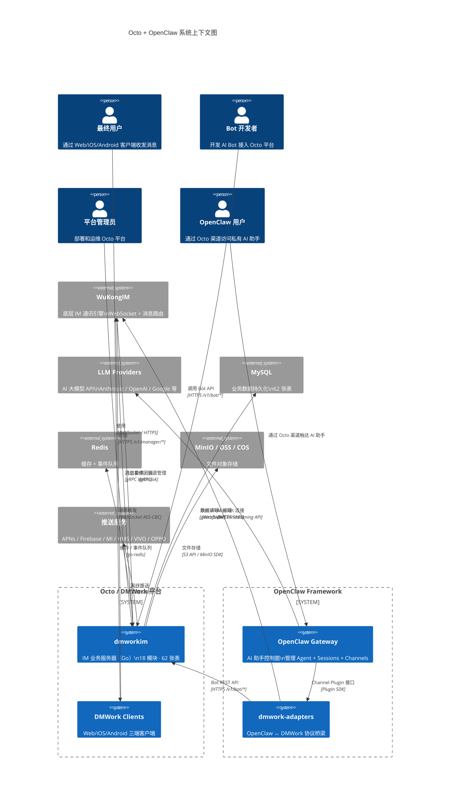
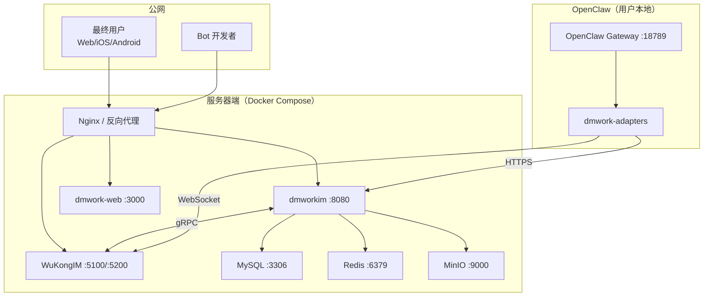

# 上下文与边界

> 系统边界图：Octo + OpenClaw 与哪些外部系统交互，用户通过哪些端点接入。

## 概述

本文档用 C4 Context 模型视角描述 Octo/DMWork + OpenClaw 的系统边界——它在哪里，它的边界在哪里，与哪些外部系统交互。

---

## C4 Context 图



---

## 系统边界说明

### 系统内部（我们负责的）

| 系统 | 语言 | 职责 |
|------|------|------|
| dmworkim | Go | IM 业务逻辑（用户/群组/Bot/Space/消息） |
| dmwork-lib | Go | Go 核心基础库，dmworkim 的基础 |
| dmwork-web | React+TS | Web/Electron 客户端 |
| dmwork-ios | Objective-C | iOS 客户端 |
| dmwork-android | Java/Kotlin | Android 客户端 |
| OpenClaw Gateway | TypeScript | AI 助手控制面 |
| dmwork-adapters | TypeScript | OpenClaw ↔ DMWork 协议桥 |

### 外部系统（第三方，我们依赖但不控制）

| 外部系统 | 集成方式 | 用途 |
|---------|---------|------|
| **WuKongIM** | gRPC（上行）+ HTTP Webhook（下行）| 底层 IM 消息路由引擎 |
| **LLM Providers** | HTTPS Streaming API | AI 推理（OpenAI/Anthropic/Google/xAI 等） |
| **MySQL** | gocraft/dbr + sql-migrate | 业务数据持久化 |
| **Redis** | go-redis | 缓存 + 异步事件队列 |
| **MinIO/OSS/COS** | S3 兼容 API | 文件/图片/音频对象存储 |
| **APNs** | Apple Push Notification | iOS 离线消息推送 |
| **Firebase FCM** | Google Firebase | Android 通用推送 |
| **小米推送** | 小米 SDK | MIUI 设备推送 |
| **华为 HMS** | Huawei SDK | 华为设备推送 |
| **VIVO 推送** | VIVO SDK | VIVO 设备推送 |
| **OPPO 推送** | OPPO SDK | OPPO 设备推送 |

---

## 用户接入点

### 最终用户接入点

| 端点 | 协议 | 说明 |
|------|------|------|
| dmwork-web（浏览器） | HTTPS + WebSocket | 直接在浏览器访问 |
| dmwork-web（Electron） | 本地应用 + WebSocket | macOS/Windows/Linux 桌面端 |
| dmwork-ios | TCP WebSocket | iPhone/iPad |
| dmwork-android | TCP WebSocket | Android 手机 |

### Bot 开发者接入点

| 接入方式 | 说明 |
|---------|------|
| `POST /v1/bot/register` | 注册 Bot，获取 IM Token |
| WebSocket + DH+AES | 直接连 WuKongIM 接收消息 |
| `POST /v1/bot/sendMessage` | 通过 Bot API 发消息 |
| OpenClaw + dmwork-adapters | 零代码接入，框架处理所有协议细节 |

### 管理员接入点

| 接入方式 | 说明 |
|---------|------|
| `GET /v1/health` | 健康检查 |
| `/v1/manager/*` 系列 | 用户管理、群组管理、消息管理 |
| Docker Compose | 部署和运维 |

---

## 关键接口定义

### dmworkim ↔ WuKongIM

```
上行（dmworkim → WuKongIM）：
  gRPC: IMSendMessage（发消息）
  gRPC: IMCreateOrUpdateChannel（频道管理）
  gRPC: IMStreamStart/End（流式消息控制）
  gRPC: IMClearConversationUnread（清除未读）
  HTTP: WuKongIM 管理 API（白名单、黑名单、在线状态）

下行（WuKongIM → dmworkim）：
  gRPC Webhook: robotMessageListen（Bot 收到消息）
  gRPC Webhook: 消息事件通知
```

### OpenClaw ↔ dmworkim（通过 dmwork-adapters）

```
上行（adapters → dmworkim Bot API）：
  POST /v1/bot/register
  POST /v1/bot/sendMessage
  POST /v1/bot/typing
  POST /v1/bot/readReceipt
  POST /v1/bot/stream/start
  POST /v1/bot/stream/end
  POST /v1/bot/heartbeat
  GET  /v1/bot/groups/:id/members

下行（WuKongIM → adapters，直接 WebSocket）：
  RECV 包（WuKongIM 推送给 Bot 的消息）
  DH+AES 加密通道
```

---

## 网络拓扑



---

## 相关页面

- [[架构概述]] — 全景架构
- [[构建块视图]] — 模块层次视图
- [[部署视图]] — Docker Compose 部署详情
- [[安全与加密]] — 网络安全机制
- [[推送系统]] — 6 平台推送配置
- [[ADR-001-双层架构]] — 双层架构决策

---

## CHANGELOG

| 版本 | 日期 | 变更说明 |
|------|------|----------|
| 0.1.0 | 2026-03-19 | 初始版本，C4 Context 图 + 系统边界说明 |
