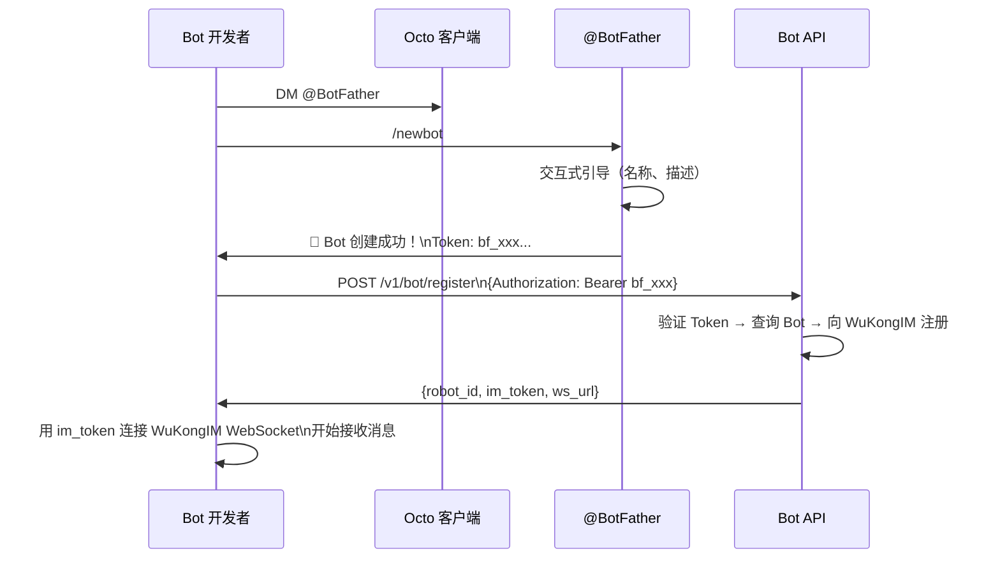

# ADR-003: Bot Token 体系（bf_ 前缀）

> 用 `bf_` 前缀的 BotFather Token 替代旧版 AppKey 认证，简化 AI Agent 接入流程。

## 概述

设计专为 AI Agent 接入优化的 Bot Token 体系，参考 Telegram BotFather 设计，让 Bot 注册和认证尽可能简单。

---

## 状态

**已接受（Accepted）**

---

## 背景与问题

Octo 需要支持 AI Bot 接入，Bot 本质上是一个特殊的"用户"（`robot=1`），需要：
1. 一种简单的方式让 AI 服务注册成为 Bot
2. Bot 调用 API 时的身份认证机制
3. Bot 能连接 WuKongIM 收发消息

**旧版方案（Robot 模块 + AppKey）的问题**：
- AppKey 是随机字符串，无法区分这是 Bot 密钥还是普通 API Key
- 注册流程复杂，需要管理员后台操作
- API 路径不直观：`/v1/robots/:id/:app_key/*`，需要携带 robot_id 和 app_key 两个参数
- 不支持对话式创建（用户无法自助创建 Bot）

---

## 决策

**采用 BotFather 模块 + bf_ 前缀 Token 体系**：

### Token 格式

```
bf_<随机字符串>

例如：bf_abc123xyz789def456
```

- `bf_` 前缀明确标识这是 BotFather 颁发的 Bot Token
- 格式设计参考 Telegram Bot Token（以 `bot` 开头）

### Bot 注册流程



### API 认证方式

```
Authorization: Bearer bf_xxx
```

dmworkim 解析 Token 流程：
```go
// botfather/service.go（逻辑示意）
func validateBotToken(token string) (bot *BotInfo, err error) {
    // 1. 解析 Bearer Token
    if !strings.HasPrefix(token, "bf_") {
        return nil, errors.New("invalid token format")
    }
    // 2. 查询数据库（robot 表 → app 表）
    bot, err = db.GetBotByToken(token)
    // 3. 验证 Bot 状态
    return
}
```

### API 端点（已验证正确路径）

| 方法 | 路径 | 说明 |
|------|------|------|
| POST | `/v1/bot/register` | 注册 Bot，获取 IM Token |
| POST | `/v1/bot/sendMessage` | 发送消息 |
| POST | `/v1/bot/typing` | 输入状态 |
| POST | `/v1/bot/readReceipt` | 已读回执 |
| POST | `/v1/bot/heartbeat` | 心跳保活 |
| POST | `/v1/bot/stream/start` | 流式消息开始 |
| POST | `/v1/bot/stream/end` | 流式消息结束 |
| POST | `/v1/bot/file/upload` | 文件上传 |
| GET | `/v1/bot/groups` | Bot 所在群组列表 |
| GET | `/v1/bot/groups/:id/members` | 群成员列表 |
| POST | `/v1/bot/messages/sync` | 同步历史消息 |
| POST | `/v1/bot/events/:id/ack` | 事件确认 |
| GET | `/v1/bot/skill.md` | 获取技能描述文档 |

---

## 理由

### 优势

1. **简单直观**：`bf_` 前缀一眼能识别这是 Bot Token，不会和其他密钥混淆（对比旧版 AppKey）。

2. **自助创建**：用户通过对话 @BotFather 就能创建 Bot，不需要管理员权限，门槛极低。参考 Telegram 已被证明是最成功的 Bot 体系之一。

3. **单一凭证**：Bot 只需持有 `bf_xxx` Token，调用所有 API 都用这一个 Token，简单。旧版需要 `robot_id` + `app_key` 两个参数。

4. **清晰的 API 路径**：`/v1/bot/*` 前缀明确，语义清楚（不是 `/v1/robots/:id/:app_key/*`）。

5. **AI 友好**：`/v1/bot/skill.md` 端点让 AI 框架可以获取 Bot 的技能描述，这是专为 AI Agent 设计的特性。

6. **流式消息支持**：stream/start + stream/end 端点专为 AI 逐字输出设计，旧版 AppKey 体系没有这些。

### 劣势与权衡

1. **双模块共存**：BotFather（新）和 Robot（旧）两个模块同时存在，有功能重叠。
   - 权衡：接受短期技术债务。旧版 Robot 模块保留是为了兼容已有集成，逐步迁移。

2. **Token 泄露风险**：`bf_` Token 一旦泄露，攻击者可以控制 Bot 发消息。
   - 缓解：Token 存储在安全的配置系统中（OpenClaw Gateway secrets），不在客户端代码中硬编码。

---

## 数据模型

```sql
-- Bot 核心信息存在 robot 表
CREATE TABLE robot (
  id BIGINT PRIMARY KEY,
  uid VARCHAR(40),               -- 对应 user 表的 uid（robot=1）
  robot_id VARCHAR(40),          -- Bot 唯一标识
  name VARCHAR(100),
  description TEXT,
  status TINYINT DEFAULT 0,      -- 0=正常, 1=禁用
  created_at DATETIME
);

-- Bot Token 在 app 表中管理（关联 robot）
-- app.app_key = bot token (bf_ 前缀)

-- user 表中 robot=1 的记录就是 Bot
-- SELECT * FROM user WHERE robot = 1;
```

---

## 与 Space API Key 的关系

Bot Token（`bf_`）用于 Bot API 认证，API Key（`uk_`）用于 OpenAI 兼容接口。

```
Bot Token (bf_xxx):
  └── 用于 /v1/bot/* 所有 Bot 操作 API

API Key (uk_xxx):
  └── 用于 OpenAI 兼容接口（/v1/chat/completions 风格）
  └── 绑定到具体 Space（user_api_key.space_id）
  └── 一个 Bot 在每个 Space 有独立的 API Key
```

参见 [[ADR-002-Space前缀约定]] 了解 API Key 与 Space 的绑定机制。

---

## 相关页面

- [[Bot系统]] — Bot 完整生命周期和 API 文档
- [[ADR-001-双层架构]] — 前置架构决策
- [[ADR-002-Space前缀约定]] — Space 与 API Key 绑定
- [[安全与加密]] — Token 安全存储和传输

---

## CHANGELOG

| 版本 | 日期 | 变更说明 |
|------|------|----------|
| 0.1.0 | 2026-03-19 | 初始版本 |
