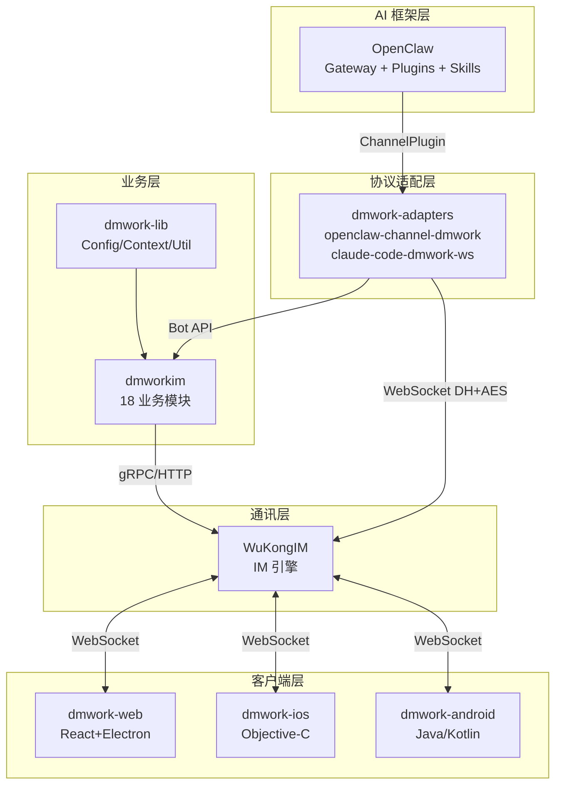
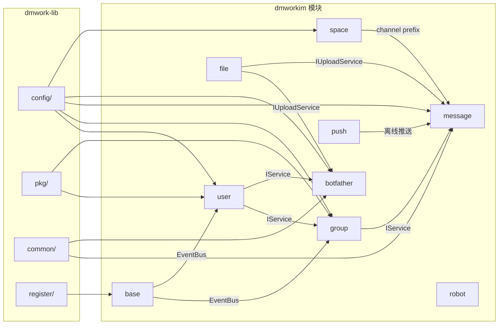

# 构建块视图

> 所有模块的层次化视图，覆盖 dmworkim 18 个模块、dmwork-lib 包、适配器、Web 包和客户端模块。

## 概述

本文档从代码构建块（Package、Module）角度展现系统结构，是开发者理解"代码在哪里"的参考文档。

---

## 顶层层次



---

## dmwork-lib（核心基础库）

**Go Module**：`github.com/dmwork-org/dmwork-lib`

```
dmwork-lib/
├── config/           — 配置管理（Config struct, Context IoC 容器）
│   ├── config.go     — Config struct（数据库、Redis、推送、IM 等所有配置字段）
│   ├── context.go    — Context（依赖注入容器，持有 DB/Redis/Cache/Event 等）
│   └── viper.go      — YAML 配置文件解析（ConfigureWithViper）
├── common/           — 业务常量和通用类型
│   ├── constant.go   — ChannelType 枚举（0-6）
│   ├── msg.go        — ContentType 常量（1-16, 97, 99, 1000+）
│   └── setting.go    — MsgHeader, Setting（位字段）
├── register/         — 模块注册系统
│   └── module.go     — Module struct，AddModule()，模块生命周期
├── pkg/              — 通用工具包
│   ├── db/           — MySQL 连接（gocraft/dbr 封装）
│   ├── redis/        — Redis 客户端封装
│   ├── cache/        — 内存缓存接口（Cache interface）
│   ├── log/          — 日志（uber-go/zap）
│   ├── pool/         — Goroutine Worker Pool（pool.Collector）
│   ├── util/
│   │   ├── dh.go     — Curve25519 DH 密钥交换
│   │   ├── aes.go    — AES-128-CBC 加密/解密
│   │   ├── hash.go   — 哈希工具
│   │   ├── sign.go   — HMAC-SHA256 签名
│   │   ├── uuid.go   — UUID 生成
│   │   └── base62.go — Base62 编码
│   ├── wkrsa/        — RSA 加密工具
│   ├── wkhook/       — Webhook gRPC 定义（webhook.proto + pb）
│   └── http/         — HTTP 客户端封装
└── wkevent/          — 事件系统接口定义
```

---

## dmworkim（主服务器）

**Go Module**：`github.com/dmwork-org/dmworkim`

### 顶层结构

```
dmworkim/
├── main.go                 — 入口（配置加载 → 模块注册 → HTTP 服务启动）
├── internal/
│   └── modules.go          — 空白导入触发 18 个模块 init()
├── modules/                — 18 个业务模块
│   ├── base/               — 基础：App 配置、事件系统
│   ├── botfather/          — AI Bot 管理中枢
│   ├── channel/            — 频道管理
│   ├── common/             — 通用配置、版本管理
│   ├── file/               — 文件存储（MinIO/OSS/COS）
│   ├── group/              — 群组完整生命周期
│   ├── message/            — 消息系统（发送/同步/搜索/回应）
│   ├── manager/            — 管理员后台
│   ├── media/              — 媒体处理
│   ├── push/               — 多平台推送（6 厂商）
│   ├── robot/              — Bot 运行时（旧版 AppKey）
│   ├── report/             — 举报系统
│   ├── rtc/                — 音视频通话
│   ├── search/             — 消息搜索（Elasticsearch）
│   ├── space/              — Space 多租户
│   ├── user/               — 用户系统
│   ├── webhook/            — Webhook 数据源
│   └── workplace/          — 工作台（App 市场）
└── pkg/                    — 项目级工具包
```

### 每个模块的标准文件结构

```
modules/xxx/
├── 1module.go      — 模块定义和 init() 自注册（必须，命名以 1 开头确保首先加载）
├── api.go          — HTTP API 端点（Gin 路由注册）
├── api_*.go        — 按功能分组的 API 文件
├── service.go      — 业务逻辑层
├── db.go           — 数据库操作层
├── db_*.go         — 按功能分组的 DB 文件
├── model.go        — 数据结构定义（请求体/响应体/数据库模型）
└── sql/            — SQL 迁移文件目录（*.sql）
```

### 18 个模块功能速查

| 模块 | 表数 | 核心 API 前缀 | 主要职责 |
|------|------|-------------|---------|
| base | 2 | `/v1/apps/` | App 信息、事件系统、Elasticsearch |
| botfather | 1 | `/v1/bot/` | Bot 注册/管理/消息/流式/文件 |
| channel | 1 | `/v1/channel/` `/v1/channels/` | 频道状态、消息自动删除 |
| common | 5 | `/v1/common/` `/v1/health` | 版本管理、背景、模块配置 |
| file | - | `/v1/file/` | 文件上传/下载（MinIO/OSS/COS） |
| group | 5 | `/v1/group/` `/v1/groups/` | 群组完整生命周期 |
| message | 15 | `/v1/message/` `/v1/conversations/` | 消息收发/同步/搜索/回应 |
| manager | - | `/v1/manager/` | 管理员后台（用户/群/消息） |
| media | - | `/v1/media/` | 媒体处理 |
| push | - | （内部） | 6 平台推送配置和发送 |
| robot | 2 | `/v1/robots/` | Bot 运行时（旧版） |
| report | 2 | `/v1/report/` | 用户举报 |
| rtc | - | `/v1/rtc/` | 音视频通话信令 |
| search | - | `/v1/search/` | Elasticsearch 全文搜索 |
| space | 3 | `/v1/space/` | Space 创建/成员/预设频道 |
| user | 15 | `/v1/user/` `/v1/users/` | 用户注册/好友/设备/API Key |
| webhook | 5 | `/v1/webhook/` | 数据源和 Webhook 事件 |
| workplace | 6 | `/v1/workplace/` | App 市场（Banner/分类/应用） |

---

## dmwork-adapters（AI 适配层）

```
dmwork-adapters/
├── openclaw-channel-dmwork/    — OpenClaw Channel Plugin
│   ├── src/
│   │   ├── channel.ts          — ChannelPlugin 实现（入口、出站发送）
│   │   ├── inbound.ts          — 入站消息处理（路由/历史/上下文注入）
│   │   ├── socket.ts           — WuKongIM 二进制协议 + DH/AES 加密
│   │   ├── api-fetch.ts        — DMWork REST API 调用封装
│   │   └── mention-utils.ts    — @mention 解析工具
│   └── openclaw.plugin.json    — 声明 channels: ["dmwork"]
│
└── claude-code-dmwork-ws/      — Claude Agent SDK 独立网关
    ├── src/
    │   ├── gateway.ts          — 主网关逻辑
    │   └── socket.ts           — WuKongIM 协议（复用）
    └── package.json
```

---

## dmwork-web（Web 客户端）

**Monorepo 工具**：Turborepo + Yarn Workspaces

```
dmwork-web/
├── apps/
│   └── web/                    — 主应用（React + Vite + Electron）
│       ├── src/
│       │   ├── pages/          — 页面组件（登录、聊天、通讯录、设置）
│       │   ├── layout/         — 布局组件
│       │   └── electron/       — Electron 主进程代码
│       └── package.json
│
└── packages/
    ├── dmworkbase/             — 核心基础包
    │   ├── src/
    │   │   ├── EndpointManager.ts  — 模块间通信总线
    │   │   ├── Provider.ts         — 状态管理（ProviderListener 模式）
    │   │   ├── IMContext.ts        — IM SDK 封装（WuKongIM JS SDK）
    │   │   └── tokens.css          — CSS Token 变量系统
    │   └── package.json
    ├── dmworkcontacts/         — 通讯录包
    ├── dmworkdatasource/       — 数据层包
    ├── dmworklogin/            — 登录鉴权包
    └── config/                 — 共享配置（TypeScript 配置、Tailwind 等）
```

---

## dmwork-ios（iOS 客户端）

**构建工具**：CocoaPods + Xcode

```
dmwork-ios/
├── TangSengDaoDaoiOS/          — 主应用（productName: LiMaoIMDemo）
│   ├── AppDelegate.m/.h
│   └── WKMainTabController.m/.h
├── Modules/
│   ├── WuKongBase/             — 基础模块（EndpointManager、IM SDK 封装）
│   │   ├── Classes/
│   │   │   └── Services/Core/
│   │   │       ├── WKEndpointManager.m/.h
│   │   │       └── ...
│   │   └── WuKongBase.podspec
│   ├── WuKongContacts/         — 通讯录模块
│   ├── WuKongDataSource/       — 数据层模块
│   ├── WuKongIMiOSSDK/         — WuKongIM iOS SDK v1.1.0
│   └── WuKongLogin/            — 登录鉴权模块
├── NotificationContent/        — 通知内容扩展（APNs 富文本通知）
├── NotificationService/        — 通知服务扩展
└── Podfile
```

---

## dmwork-android（Android 客户端）

**构建工具**：Gradle multi-module

```
dmwork-android/
├── app/                        — 主应用模块
├── wkbase/                     — 基础模块（EndpointManager、IM SDK 封装）
│   └── src/main/java/
│       └── EndpointManager.java/.kt
├── wkcontacts/                 — 通讯录模块
├── wkdatasource/               — 数据层模块
├── wklogin/                    — 登录鉴权模块
├── wkui/                       — UI 基础组件库
└── build.gradle（root）
```

**Android 推送集成**（6 厂商）：

| 厂商 | SDK | 适用场景 |
|------|-----|---------|
| 小米推送 | MiPush SDK | MIUI 设备 |
| 华为 HMS | Huawei Push Kit | 华为/荣耀设备 |
| VIVO 推送 | VPush SDK | VIVO/iQOO 设备 |
| OPPO 推送 | OPush SDK | OPPO/一加/真我设备 |
| Firebase FCM | Google Firebase | 国际版/其他 Android |
| APNs | Apple（通过 FCM） | 备用 |

---

## 模块依赖关系图



---

## 相关页面

- [[架构概述]] — 全景架构
- [[运行时视图]] — 关键场景时序图
- [[Bot系统]] — BotFather + Robot 模块详情
- [[Space多租户]] — Space 模块详情
- [[推送系统]] — Push 模块详情
- [[安全与加密]] — DH/AES 加密（pkg/util/dh.go、aes.go）

---

## CHANGELOG

| 版本 | 日期 | 变更说明 |
|------|------|----------|
| 0.1.0 | 2026-03-19 | 初始版本，汇总所有模块层次 |
