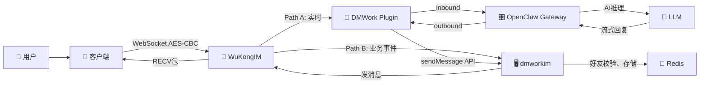

# 架构概述

> Octo + OpenClaw 是一个 7 层项目生态，从 AI 框架到 IM 引擎，从适配层到三端客户端，每层各司其职。

## 概述

整体架构采用**双层 + 适配器**的设计：OpenClaw 作为 AI 框架层，dmwork-adapters 作为协议适配层，dmworkim 作为业务层，WuKongIM 作为通讯传输层，三端客户端直接与 WuKongIM 交互。

---

## 全景架构图

```
┌─────────────────────────────────────────────────────────────────┐
│                        OpenClaw Framework                        │
│         个人 AI 助手框架 · TypeScript · 32万+ Stars               │
│  Gateway(控制面) + Channels(20+渠道) + Agents + Skills + Plugins  │
└──────────────────────────────┬────────────────────────────────────┘
                               │ Channel Plugin
                               ▼
┌─────────────────────────────────────────────────────────────────┐
│                     dmwork-adapters (TypeScript)                  │
│        openclaw-channel-dmwork │ claude-code-dmwork-ws           │
│     WebSocket 接入 · DH+AES 加密 · 流式消息 · @mention 解析       │
└──────────────────────────────┬────────────────────────────────────┘
                               │ Bot API (HTTP)
                               ▼
┌─────────────────────────────────────────────────────────────────┐
│                      dmworkim (Go · 主服务器)                     │
│  18 个业务模块 · 62 张数据表 · BotFather · Space 多租户             │
│         ┌──────────┐                                             │
│         │dmwork-lib│ ← 核心基础库 (Config/Context/工具包)          │
│         └──────────┘                                             │
└──────────────────────────────┬────────────────────────────────────┘
                               │ gRPC / HTTP
                               ▼
                    ┌──────────────────┐
                    │    WuKongIM       │
                    │  底层通讯引擎      │
                    │  WebSocket 协议   │
                    └──────────────────┘
                               ▲
              ┌────────────────┼────────────────┐
              │                │                │
        ┌─────────┐     ┌──────────┐     ┌───────────┐
        │dmwork-web│    │dmwork-ios│    │dmwork-android│
        │React+TS  │    │Obj-C     │    │Java/Kotlin  │
        │+Electron │    │CocoaPods │    │Gradle       │
        └─────────┘     └──────────┘     └───────────┘
```

---

## 7 个项目详解

### 1. OpenClaw Framework

| 属性 | 值 |
|------|-----|
| 语言 | TypeScript |
| 定位 | 个人 AI 助手框架 |
| 规模 | 309MB, 32万 Stars |
| 核心组件 | Gateway, Channels, Agents, Skills, Plugins |

**核心职能**：
- 运行 AI Agent，管理对话 Session
- 通过 Channel Plugin 接入 20+ IM 渠道
- 提供工具调用框架（exec、read、write、web_search 等）
- 支持 ACP（外部 Agent Harness：Claude Code、Codex、Pi）

---

### 2. dmwork-adapters

| 属性 | 值 |
|------|-----|
| 语言 | TypeScript (ESM) |
| 定位 | AI 适配层（OpenClaw ↔ DMWork 桥梁） |
| 规模 | 610KB, 2 个适配器 |

**两个适配器**：
- `openclaw-channel-dmwork`：作为 OpenClaw Channel Plugin，深度集成进框架生命周期
- `claude-code-dmwork-ws`：独立网关进程，面向 Claude Agent SDK

**核心功能**：DH+AES 加密、WuKongIM 二进制协议解析、流式消息、@mention 解析

---

### 3. dmworkim（主服务器）

| 属性 | 值 |
|------|-----|
| 语言 | Go 1.20 |
| 定位 | IM 业务逻辑层 |
| 规模 | 342MB, 18 模块, 62 张表 |
| 框架 | Gin, gocraft/dbr, go-redis, gRPC |

**18 个模块**：
base, botfather, channel, common, file, group, message, manager, media, push, robot, report, rtc, search, space, user, webhook, workplace

---

### 4. dmwork-lib（核心基础库）

| 属性 | 值 |
|------|-----|
| 语言 | Go 1.20 |
| 定位 | 所有 Go 模块的基础依赖 |
| 规模 | 181KB |

**核心包**：Config、Context（IoC 容器）、WuKongIM API 封装、模块注册系统

---

### 5. dmwork-web

| 属性 | 值 |
|------|-----|
| 语言 | React + TypeScript |
| 定位 | Web/PC 客户端 |
| 规模 | 15MB, 6 packages |
| 构建 | Turborepo + Yarn Workspaces |

**6 个包**：apps/web、packages/dmworkbase、packages/dmworkcontacts、packages/dmworkdatasource、packages/dmworklogin、packages/config

---

### 6. dmwork-ios

| 属性 | 值 |
|------|-----|
| 语言 | Objective-C |
| 定位 | iOS 客户端 |
| 规模 | 120MB |
| 构建 | CocoaPods + Xcode |

**5 个 Pod 模块**：WuKongBase、WuKongContacts、WuKongDataSource、WuKongIMiOSSDK、WuKongLogin

---

### 7. dmwork-android

| 属性 | 值 |
|------|-----|
| 语言 | Java + Kotlin |
| 定位 | Android 客户端 |
| 规模 | 139MB |
| 构建 | Gradle multi-module |

**6 个模块**：app、wkbase、wkcontacts、wkdatasource、wklogin、wkui

---

## 数据流概述

### 消息流转三条路径



**Path A（实时 WebSocket）**：用户 → WuKongIM → WKSocket(DH+AES) → Plugin → Gateway → LLM → 回复

**Path B（业务事件）**：用户 → WuKongIM → DMWork Server → Redis 事件队列（好友校验、消息存储、未读清除）

**Path C（流式响应）**：LLM → Gateway → Plugin → stream/start → 多次 sendMessage → stream/end

---

## 技术栈汇总

| 层次 | 技术 |
|------|------|
| IM 引擎 | WuKongIM (Go, 自定义二进制协议, WebSocket) |
| 业务后端 | Go 1.20, Gin, gocraft/dbr, go-redis, gRPC, MySQL |
| AI 适配 | TypeScript, WebSocket, Curve25519 DH, AES-128-CBC |
| AI 框架 | OpenClaw (Node.js, TypeScript, Plugin-based) |
| Web 前端 | React 17, TypeScript 5, Semi Design, Turborepo, Electron 26 |
| iOS | Objective-C, CocoaPods, WuKongIM iOS SDK, PromiseKit |
| Android | Java/Kotlin, Gradle, WuKongIM Android SDK, RxJava3, Retrofit2 |
| 存储 | MySQL (62 表, 消息分片), Redis (缓存+事件队列), MinIO/OSS/COS (文件) |
| 推送 | APNs, Firebase, 小米, 华为 HMS, VIVO, OPPO |
| 安全 | DH 密钥交换, AES-CBC, Signal 协议, HMAC-SHA256 |

---

## 关键设计模式

| 模式 | 说明 |
|------|------|
| 双层架构 | 业务层（dmworkim）与通讯层（WuKongIM）分离，gRPC/HTTP 交互 |
| 模块自注册 | Go `init()` + `register.AddModule()`，零配置加载所有模块 |
| EndpointManager | 三端统一的模块间通信，避免循环依赖 |
| Channel 抽象 | OpenClaw 一个接口统一 20+ IM 渠道 |
| Plugin Hook 链 | 生命周期钩子实现可扩展性 |
| Session Key 路由 | 字符串 key 精确路由到 Agent + 会话 |
| 消息分片 | `message_id % 5` 分表，水平扩展 |
| Channel ID 前缀 | `s{spaceId}_` 轻量多租户，零迁移 |
| Bot Token 体系 | `bf_` 前缀 Token 替代 AppKey |
| 流式消息协议 | stream/start → N × sendMessage → stream/end |

---

## 相关页面

- [[上下文与边界]] — 系统边界和外部依赖
- [[构建块视图]] — 模块层次视图
- [[运行时视图]] — 关键场景时序图
- [[部署视图]] — Docker Compose 部署
- [[ADR-001-双层架构]] — 双层架构决策
- [[Bot系统]] — Bot 集成架构
- [[Space多租户]] — 多租户架构

---

## CHANGELOG

| 版本 | 日期 | 变更说明 |
|------|------|----------|
| 0.1.0 | 2026-03-19 | 初始版本，按标准规范重组 |
