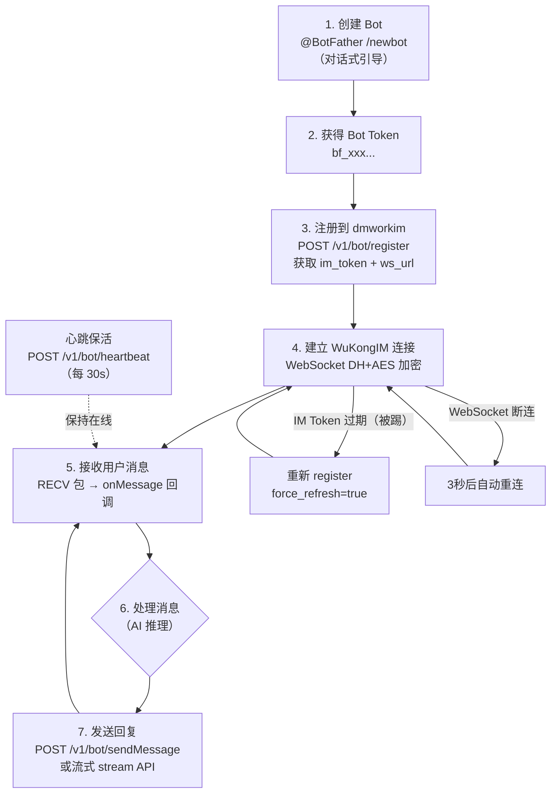

# Bot 系统

> Bot = 特殊用户（robot=1）；BotFather 管理 Bot 生命周期，Robot 模块处理运行时事件；`bf_` Token 是 Bot 的身份凭证。

## 概述

Octo 的 Bot 系统由两个模块组成：**BotFather**（新版，管理 Bot 的创建/Token/API）和 **Robot**（旧版，运行时事件投递）。

Bot 在数据模型上是 `user` 表中 `robot=1` 的特殊用户。

---

## Bot 的本质

```sql
-- Bot 是 user 表中的特殊记录
SELECT * FROM user WHERE robot = 1;

-- robot 表存储 Bot 的扩展信息
-- robot.robot_id = user.uid
CREATE TABLE robot (
  id BIGINT PRIMARY KEY,
  uid VARCHAR(40),           -- 对应 user.uid
  robot_id VARCHAR(40),      -- Bot 唯一 ID
  name VARCHAR(100),
  description TEXT,
  status TINYINT DEFAULT 0,  -- 0=正常, 1=禁用
  created_at DATETIME
);

-- Bot 菜单命令
CREATE TABLE robot_menu (
  robot_id VARCHAR(40),
  cmd VARCHAR(100),          -- 命令名（如 /start）
  remark VARCHAR(200),       -- 命令描述
  created_at DATETIME
);
```

---

## BotFather vs Robot 模块对比

| 维度 | BotFather 模块（新版） | Robot 模块（旧版） |
|------|----------------------|------------------|
| 职责 | Bot 管理（创建/Token/上架） | Bot 运行时（消息投递/事件） |
| 认证方式 | Bot Token（`bf_` 前缀） | AppKey（旧方式） |
| API 路径前缀 | `/v1/bot/*` | `/v1/robots/:id/:app_key/*` |
| AI 优化 | ✅ stream API, skill.md | ✅ 事件队列, InlineQuery |
| 创建方式 | 对话式（@BotFather /newbot） | 管理员后台 |
| 当前状态 | **推荐使用** | 向后兼容保留 |

---

## Bot 完整生命周期



---

## BotFather API 端点完整列表（已验证）

> ⚠️ 以下路径已通过源码核验（verification_dmworkim.md），均为正确路径。

### Bot 核心 API

| 方法 | 路径 | 说明 | 认证 |
|------|------|------|------|
| POST | `/v1/bot/register` | Bot 注册，获取 IM Token | Bearer bf_xxx |
| POST | `/v1/bot/sendMessage` | 发送消息 | Bearer bf_xxx |
| POST | `/v1/bot/typing` | 发送输入状态 | Bearer bf_xxx |
| POST | `/v1/bot/readReceipt` | 发送已读回执 | Bearer bf_xxx |
| POST | `/v1/bot/heartbeat` | 心跳保活 | Bearer bf_xxx |
| POST | `/v1/bot/messages/sync` | 同步历史消息 | Bearer bf_xxx |

### 流式消息 API

| 方法 | 路径 | 说明 |
|------|------|------|
| POST | `/v1/bot/stream/start` | 流式消息开始，返回 stream_no |
| POST | `/v1/bot/stream/end` | 流式消息结束 |

### 文件 API

| 方法 | 路径 | 说明 |
|------|------|------|
| POST | `/v1/bot/file/upload` | Bot 上传文件 |
| POST | `/v1/bot/upload` | Bot 上传文件（兼容旧路径） |
| GET | `/v1/bot/file/download/*path` | Bot 文件下载 |
| GET | `/v1/botfile/*path` | Bot 文件代理访问 |
| POST | `/v1/botfile/upload` | Bot 文件代理上传 |

### 群组 API

| 方法 | 路径 | 说明 |
|------|------|------|
| GET | `/v1/bot/groups` | Bot 所在群组列表 |
| GET | `/v1/bot/groups/:group_no` | 获取群组信息 |
| GET | `/v1/bot/groups/:group_no/members` | 获取群成员列表 |

### Bot 事件 API

| 方法 | 路径 | 说明 |
|------|------|------|
| POST | `/v1/bot/events` | 获取事件（长轮询） |
| POST | `/v1/bot/events/:event_id/ack` | 事件确认 |

### 技能文档 API

| 方法 | 路径 | 说明 |
|------|------|------|
| GET | `/v1/bot/skill.md` | 获取 Bot 技能描述文档（Markdown） |

### 命令 API

| 方法 | 路径 | 说明 |
|------|------|------|
| POST | `/v1/bot/setCommands` | 设置 Bot 命令列表 |

### 用户 Bot API（自建 Bot）

| 方法 | 路径 | 说明 |
|------|------|------|
| POST | `/v1/user/bots` | 创建用户 Bot |
| GET | `/v1/user/bots` | 列出用户的 Bot |
| PUT | `/v1/user/bots/:bot_id` | 更新用户 Bot |
| DELETE | `/v1/user/bots/:bot_id` | 删除用户 Bot |
| GET | `/v1/user/bots/:bot_id/token` | 获取用户 Bot Token |

### 好友申请 API

| 方法 | 路径 | 说明 |
|------|------|------|
| POST | `/v1/bot/apply` | Bot 申请加好友 |
| POST | `/v1/bot/apply/sure` | 确认 Bot 好友申请 |
| PUT | `/v1/bot/apply/refuse/:apply_id` | 拒绝 Bot 好友申请 |
| GET | `/v1/bot/applies` | 好友申请列表 |

---

## 关键数据结构

### 注册请求 / 响应

```go
// POST /v1/bot/register 请求
// Headers: Authorization: Bearer bf_xxx

// 响应
type BotRegisterResp struct {
    RobotID       string // Bot 的 IM 用户 ID
    IMToken       string // 用于连接 WuKongIM WebSocket
    WSURL         string // WuKongIM WebSocket 地址
    APIURL        string // dmworkim API 地址
    OwnerUID      string // Bot 创建者 UID
    OwnerChannelID string // Bot 创建者的 Channel ID
}
```

### 发送消息请求

```go
// POST /v1/bot/sendMessage
type BotSendMessageReq struct {
    ChannelID   string                 `json:"channel_id"`
    ChannelType int                    `json:"channel_type"`  // 1=DM, 2=群聊
    StreamNo    string                 `json:"stream_no,omitempty"`
    Payload     map[string]interface{} `json:"payload"`
}

// Payload 结构（文本消息）
{
    "type": 1,           // ContentType: 1=文本
    "content": "回复内容",
    "mention": {         // @mention（群聊时）
        "uids": ["user_uid_1"]
    }
}
```

### 流式消息

```go
// POST /v1/bot/stream/start
type BotStreamStartReq struct {
    ChannelID   string `json:"channel_id"`
    ChannelType int    `json:"channel_type"`
    Payload     []byte `json:"payload"`  // base64 编码的 JSON payload
}
// 响应: { "stream_no": "xxx-yyy" }

// POST /v1/bot/stream/end
type BotStreamEndReq struct {
    StreamNo    string `json:"stream_no"`
    ChannelID   string `json:"channel_id"`
    ChannelType int    `json:"channel_type"`
}
```

---

## 群聊中的 Bot

### 触发条件

```
1. 消息 payload.mention.uids 包含 Bot 的 uid（明确 @Bot）
2. dmworkim robotMessageListen 检测到 Bot 在群里（DM 直接触发）
```

### 群聊 Bot 标识

- `user.robot = 1` 标识 Bot 用户
- 群成员列表 API 返回的 members 中包含 `robot` 字段
- Web 客户端根据 `robot=1` 显示 Bot 角标（进行中功能）

---

## 事件系统（Redis 事件队列）

Bot 收到消息的并行路径（参见 [[运行时视图]] Phase 3）：

```
WuKongIM → dmworkim（gRPC robotMessageListen）
                ↓
          验证好友关系（MySQL）
                ↓
          Redis ZADD robotEvent:{robotID}
          （存储事件，Bot 通过长轮询 /v1/bot/events 获取）
```

这是一个备用/补充路径，主路径是 Bot 通过 WebSocket 直接从 WuKongIM 接收 RECV 包。

---

## OpenClaw 中的 Bot 接入

使用 `openclaw-channel-dmwork` 插件，OpenClaw 自动处理：

```typescript
// openclaw.plugin.json
{
  "id": "dmwork",
  "channels": ["dmwork"],
  "configSchema": {
    "apiUrl": { "type": "string" },
    "botToken": { "type": "string" }  // bf_xxx
  }
}
```

**OpenClaw 帮你自动处理**：
- ✅ DH+AES 加密 WebSocket 连接
- ✅ Bot 注册（POST /v1/bot/register）
- ✅ 心跳保活（HTTP heartbeat + WuKongIM PING）
- ✅ 流式消息发送（stream/start → sendMessage → stream/end）
- ✅ typing 状态（收到消息后自动发送，每 5s 续期）
- ✅ 已读回执（readReceipt）
- ✅ @mention 双向解析（入站 uid→name，出站 name→uid）
- ✅ 群聊历史上下文注入
- ✅ Token 过期自动重新注册
- ✅ 断线 3 秒自动重连

---

## 相关页面

- [[术语表]] — BotFather、Bot Token、Robot 等术语定义
- [[安全与加密]] — Bot Token 认证机制
- [[运行时视图]] — Bot 消息接收和回复的完整时序
- [[Space多租户]] — Bot 在 Space 中的 API Key 绑定
- [[ADR-003-Bot-Token体系]] — Bot Token 设计决策

---

## CHANGELOG

| 版本 | 日期 | 变更说明 |
|------|------|----------|
| 0.1.0 | 2026-03-19 | 初始版本，API 端点已通过源码核验 |
