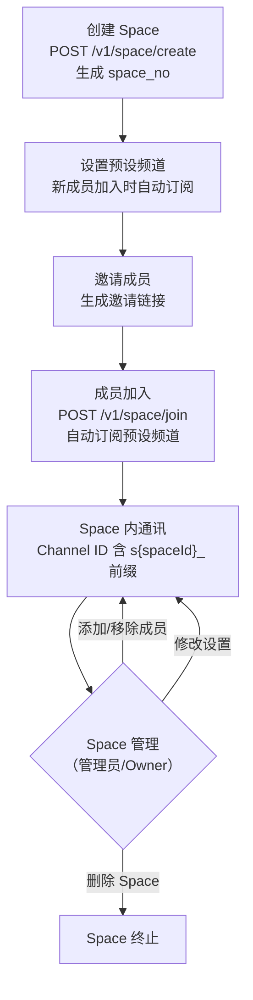
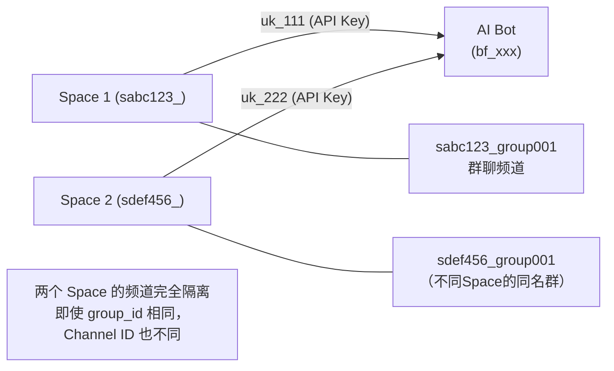

# Space 多租户

> Space 用 Channel ID 前缀约定（`s{spaceId}_`）实现零迁移成本的轻量多租户隔离。

## 概述

Space 是 Octo 的多租户单元，类似 Slack 的 Workspace。不同 Space 的频道通过 Channel ID 前缀约定相互隔离，无需修改 WuKongIM 底层。

---

## 核心设计：Channel ID 前缀约定

```
s{spaceId}_{userId}     ← Space 内的私聊（DM）频道标识
s{spaceId}_{groupId}    ← Space 内的群聊频道标识
```

**示例**：
```
Space ID: abc123
用户 ID: user001
群聊 ID: group001

DM 频道：sabc123_user001
群聊频道：sabc123_group001
```

**为什么用前缀而不是独立表？**
- 参见 [[ADR-002-Space前缀约定]] 了解完整决策过程
- 零数据迁移、极简数据模型、WuKongIM 无感知

---

## 数据模型（3 张表）

```sql
-- Space 主表
CREATE TABLE space (
  id BIGINT PRIMARY KEY AUTO_INCREMENT,
  space_no VARCHAR(40) NOT NULL UNIQUE,   -- Space 唯一编号（系统生成）
  name VARCHAR(100) NOT NULL,
  creator_uid VARCHAR(40) NOT NULL,        -- 创建者 UID
  max_member_count INT DEFAULT 500,        -- 最大成员数
  created_at DATETIME DEFAULT NOW(),
  updated_at DATETIME DEFAULT NOW()
);

-- Space 成员表
CREATE TABLE space_member (
  id BIGINT PRIMARY KEY AUTO_INCREMENT,
  space_no VARCHAR(40) NOT NULL,
  uid VARCHAR(40) NOT NULL,
  role TINYINT DEFAULT 0,                  -- 0=member, 1=admin, 2=owner
  created_at DATETIME DEFAULT NOW(),
  UNIQUE KEY uk_space_uid (space_no, uid)
);

-- Space 预设频道表（新成员加入时自动订阅）
CREATE TABLE space_preset_channel (
  id BIGINT PRIMARY KEY AUTO_INCREMENT,
  space_no VARCHAR(40) NOT NULL,
  channel_id VARCHAR(100) NOT NULL,        -- 含 s{spaceId}_ 前缀
  channel_type SMALLINT NOT NULL,          -- 1=DM, 2=群聊
  UNIQUE KEY uk_space_channel (space_no, channel_id, channel_type)
);
```

---

## API 端点（已验证）

> ⚠️ **路径勘误**：正确路径为 `/v1/space/`（单数，无 's'），已通过源码核验。

### 用户侧 API

| 方法 | 路径 | 说明 | 认证 |
|------|------|------|------|
| POST | `/v1/space/create` | 创建 Space | JWT |
| GET | `/v1/space/my` | 我加入的 Space 列表 | JWT |
| POST | `/v1/space/join` | 加入 Space | JWT |
| GET | `/v1/space/:space_id` | 获取 Space 信息 | JWT |
| GET | `/v1/space/invite/:invite_code` | 邀请链接信息 | 无需认证 |
| GET | `/v1/space/invite/:invite_code/preview` | 邀请链接预览 | 无需认证 |

---

## API Key 隔离（2026-03 新增）

每个 Bot 在每个 Space 中有独立的 API Key，实现 OpenAI 兼容接口的 Space 级别隔离。

### 数据库变更

```sql
-- user_api_key 表新增 space_id 字段
ALTER TABLE user_api_key ADD COLUMN space_id VARCHAR(40);
ALTER TABLE user_api_key ADD UNIQUE INDEX idx_uid_space (uid, space_id);
```

### 隔离逻辑

```
Bot Token（bf_xxx）：全局唯一，一个 Bot 只有一个
       ↓
API Key（uk_xxx）：每个 Bot 在每个 Space 有独立的 API Key
  - Bot A 在 Space 1：uk_abc111
  - Bot A 在 Space 2：uk_abc222
  - Bot B 在 Space 1：uk_abc333
```

### 用途

OpenAI 兼容接口（`/v1/chat/completions`）通过 API Key 确定：
1. 是哪个 Bot 在调用
2. 属于哪个 Space
3. 使用哪个 LLM（Bot 在该 Space 配置的模型）

---

## Space 生命周期



---

## Space 与 Bot 的交互



---

## 事件系统集成

Space 成员操作会触发系统事件：

```go
// 事件常量（modules/base/event/api.go）
"space.member.join"    // 用户加入 Space

// 事件处理：
// 1. 将新成员加入预设频道（space_preset_channel）
// 2. 向 WuKongIM 注册频道订阅
// 3. 发送欢迎系统消息
```

---

## 前端（dmwork-web）的 Space 功能

Web 客户端的 Space 功能特性：

- **Space 切换**：侧边栏 Space 列表，点击切换 Space 上下文
- **Space 内会话**：会话列表过滤到当前 Space
- **Space 设置**：管理员可管理成员、预设频道
- **Space 邀请**：生成邀请链接，H5 页面确认加入

---

## 注意事项

### Channel ID 前缀约定的隐式契约

> ⚠️ 所有 Space 内的 Channel 创建代码**必须**加 `s{spaceId}_` 前缀，这是隐式契约，无编译期检查。

**查询 Space 内所有频道**：
```sql
SELECT * FROM space_preset_channel WHERE space_no = ? AND channel_id LIKE 's%_%';
-- 或更精确：
SELECT * FROM space_preset_channel 
WHERE space_no = ? AND channel_id LIKE CONCAT('s', space_no, '_%');
```

### 无 Space 的全局频道

不带 `s{spaceId}_` 前缀的 Channel 是全局频道（普通 DM 和群聊）：
```
user001              ← 全局 DM 频道
group001             ← 全局群聊频道
sabc123_user001      ← Space abc123 内的 DM
sabc123_group001     ← Space abc123 内的群聊
```

---

## 相关页面

- [[ADR-002-Space前缀约定]] — Space 设计决策
- [[Bot系统]] — Bot 在 Space 中的 API Key
- [[构建块视图]] — Space 模块（modules/space/）
- [[架构概述]] — Space 在整体架构中的位置
- [[术语表]] — Space、Channel、ChannelType 术语

---

## CHANGELOG

| 版本 | 日期 | 变更说明 |
|------|------|----------|
| 0.1.0 | 2026-03-19 | 初始版本；API 路径已验证（/v1/space/ 非 /v1/spaces/） |
