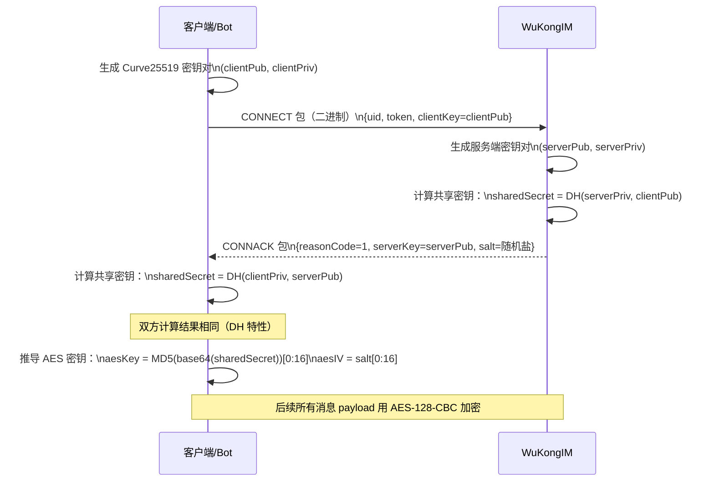
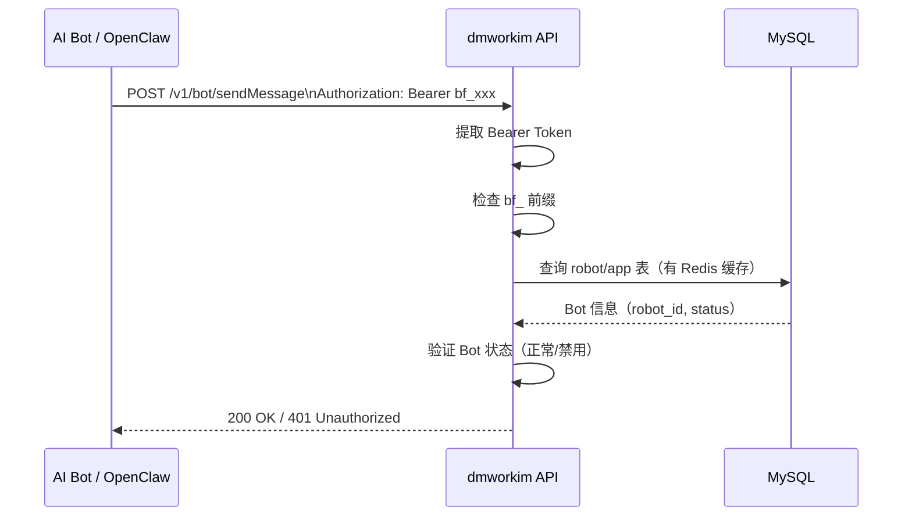

# 安全与加密

> 四层安全机制：DH+AES 传输加密、Bot Token 认证、Signal 端到端加密、HMAC-SHA256 Webhook 签名。

## 概述

Octo + OpenClaw 生态系统中，安全机制分布在多个层次，从传输层加密到应用层认证，从服务端签名到端到端加密。

---

## 1. WuKongIM 传输加密：DH + AES-128-CBC

### 机制概述

所有 WuKongIM WebSocket 连接（客户端或 Bot）在建立时都进行 **Diffie-Hellman 密钥交换**，之后所有消息 payload 用协商出的密钥进行 **AES-128-CBC 加密**。

### 密钥交换流程



### AES 加密细节

```
算法：AES-128-CBC
密钥长度：128 bit（16 字节）
aesKey = MD5(base64(sharedSecret))[0:16]   -- 取 MD5 结果前 16 字节
aesIV  = salt[0:16]                         -- 取 CONNACK 中 salt 的前 16 字节

加密范围：
  - SEND 包的消息 payload（客户端发给服务端）
  - RECV 包的消息 payload（服务端推给客户端）
  - 每个连接有独立密钥
  - 断线重连后重新协商
```

### 代码位置

```
dmwork-lib/pkg/util/dh.go    — Curve25519 DH 实现
dmwork-lib/pkg/util/aes.go   — AES-128-CBC 加/解密
dmwork-adapters/src/socket.ts — WuKongIM 二进制协议 + DH/AES（TypeScript）
```

### 二进制协议帧格式

```
[PacketType(4bit) | Flags(4bit)] [VariableLength] [Payload]

包类型：
  CONNECT(1)    — 客户端发起连接，含 DH 公钥
  CONNACK(2)    — 服务端确认，含服务端 DH 公钥 + salt
  SEND(3)       — 客户端发消息（payload AES 加密）
  SENDACK(4)    — 服务端确认收到
  RECV(5)       — 服务端推消息给客户端（payload AES 加密）
  RECVACK(6)    — 客户端确认收到（防重复投递）
  PING(7)       — 心跳请求
  PONG(8)       — 心跳响应
  DISCONNECT(9) — 断开连接
```

---

## 2. Bot Token 认证

### 认证流程



### Token 安全实践

| 实践 | 说明 |
|------|------|
| 安全存储 | 存储在 OpenClaw Gateway secrets，不硬编码在代码中 |
| HTTPS 传输 | 所有 Bot API 调用走 HTTPS，Token 在请求头中 |
| 最小权限 | Bot Token 只能操作该 Bot 的会话和群组，不能访问其他 Bot |
| Token 吊销 | BotFather 管理员可吊销 Token（将 robot.status 置为禁用） |

---

## 3. Signal 协议（端到端加密）

### 机制说明

Signal Protocol 是业界标准的端到端加密协议，提供完美前向保密（PFS）。

**在 Octo 中的实现**：

```sql
-- message 表中的 signal 字段
CREATE TABLE message_0 (
  ...
  signal INT DEFAULT 0,    -- 0=普通加密, 1=Signal 端到端加密
  ...
);
```

- iOS 客户端原生支持 Signal 加密（`WuKongBase` Pod 内嵌 Signal 库）
- 当 `setting.signal=true` 时，消息走 Signal 协议，服务器无法解密内容
- dmworkim 消息表存储的是加密后的密文，服务端不参与解密

### 支持情况

| 端 | Signal 支持 |
|----|------------|
| iOS | ✅（WuKongBase 内嵌） |
| Android | ✅（WuKongIM Android SDK） |
| Web | ❓（待确认） |
| Bot（dmwork-adapters） | ❌（Bot 无需端到端加密） |

---

## 4. HMAC-SHA256 Webhook 签名

### 机制说明

当 dmworkim 向外部 Webhook 端点发送事件时，使用 HMAC-SHA256 对请求体签名，接收方可以验证消息的完整性和来源。

### 签名流程

```
1. 计算签名：
   signature = HMAC-SHA256(secret_key, request_body)
   
2. 将签名放在请求头：
   X-Webhook-Signature: sha256=<hex_signature>

3. 接收方验证：
   expected = HMAC-SHA256(secret_key, request_body)
   if expected == received_signature:
       # 消息可信
```

### 代码位置

```
dmwork-lib/pkg/util/sign.go   — HMAC-SHA256 签名实现
modules/webhook/              — Webhook 发送逻辑
```

---

## 5. 其他安全机制

### 5.1 IP 黑名单

```sql
-- common 模块维护
CREATE TABLE ip_blacklist (
  ip VARCHAR(45) NOT NULL,
  reason TEXT,
  created_at DATETIME
);
```

dmworkim 中间件层检查请求 IP，命中黑名单直接拒绝。

### 5.2 JWT 用户认证

普通用户（非 Bot）的 API 请求使用 JWT Token 认证：
- 登录时颁发 JWT（`AuthMiddleware`）
- 所有需要登录的 API 路由都经过 `AuthMiddleware` 中间件

### 5.3 OpenTracing 链路追踪

```go
// Gin 中间件
Tracer GinMiddle()   — 每个请求注入 TraceID，可用于安全审计
```

### 5.4 敏感词过滤

```sql
-- message 模块维护
CREATE TABLE sensitive_word (
  word VARCHAR(100),
  type TINYINT    -- 过滤类型
);
```

消息发送前经过敏感词检查，命中则拒绝或替换。

---

## 安全配置清单

| 配置项 | 说明 | 默认值 |
|--------|------|--------|
| `mode` | 运行模式（注意：YAML 未配置时 fallback 为 debug） | `release`（New()）/ `debug`（Viper fallback） |
| `db.mysql.password` | MySQL 密码，必须设置强密码 | 无 |
| `storage.minio.secretKey` | MinIO 密钥 | `minioadmin`（务必修改） |
| Bot Token | `bf_` 前缀，存储在 Gateway secrets | 无 |
| HTTPS | 生产环境强制启用 | 无（需在 Nginx 配置） |

> ⚠️ **已知问题**：`ConfigureWithViper` 中 Mode 的 fallback 是 `debug`，而非预期的 `release`。生产部署时必须显式在 YAML 中设置 `mode: release`。（参见 `verification_batch1.md` CRITICAL-1）

---

## 相关页面

- [[术语表]] — DH、AES、HMAC 等术语定义
- [[Bot系统]] — Bot Token 认证流程
- [[ADR-003-Bot-Token体系]] — Bot Token 设计决策
- [[运行时视图]] — 完整消息流中的加密点
- [[部署视图]] — HTTPS/TLS 配置

---

## CHANGELOG

| 版本 | 日期 | 变更说明 |
|------|------|----------|
| 0.1.0 | 2026-03-19 | 初始版本，汇总四层安全机制 |
