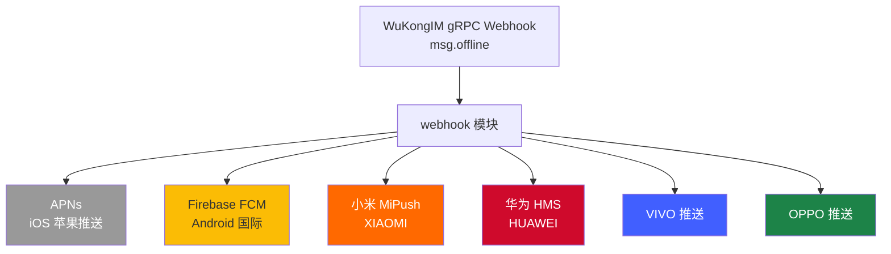

# 推送系统

> 离线消息的最后一公里：6 平台推送统一分发架构。

[[Bot系统|← 横切关注点：Bot系统]] | [[Space多租户|← 横切关注点：Space多租户]]

## 概述

DMWork 推送系统位于 `dmworkim` 的 **webhook 模块**中。当用户离线时，WuKongIM 通过 gRPC Webhook 通知业务层，由 webhook 模块将消息转化为各平台推送通知。

支持 **6 个推送平台**，覆盖 iOS、Android 国内外全部主流渠道：



## 架构设计

### 推送链路全景

```
用户 A 发消息
     │
     ▼
WuKongIM（通讯层）
     │
     │ gRPC msg.offline 事件
     ▼
webhook 模块（dmworkim）
     │
     ├── 读取用户设备 token（device_token 表）
     ├── 判断平台（iOS / Android）
     ├── 构建推送 Payload（消息摘要/发送者/channelID）
     │
     ├── iOS → APNs（push_iosapns.go）
     └── Android → 厂商分流
             ├── Firebase FCM（push_firebase.go）
             ├── 华为 HMS（push_hms.go）
             ├── 小米 MiPush（push_mi.go）
             ├── OPPO（push_oppo.go）
             └── VIVO（push_vivo.go）
```

### 设备 Token 注册流程

客户端启动后向服务端注册推送 Token：

```
POST /v1/user/device_token
{
  "device_token": "xxx",
  "bundle_id":    "com.dmwork.im",
  "device_flag":  2,    // 1=iOS 2=Android
  "push_type":    "mi"  // "apns"|"firebase"|"mi"|"hms"|"vivo"|"oppo"
}
```

注销时：
```
DELETE /v1/user/device_token
```

## 六大推送平台

### 1. APNs（苹果推送）

| 项目 | 详情 |
|------|------|
| 实现文件 | `modules/webhook/push_iosapns.go` |
| 协议 | HTTP/2 + JWT |
| 证书格式 | `.p8` 私钥（APNs Auth Key） |
| 配置项 | `apns.keyid`、`apns.teamid`、`apns.bundle_id`、`apns.cert_path` |
| 生产/沙箱 | 通过 `apns.is_dev` 区分 |
| 推送格式 | `aps.alert`（title + body）+ `aps.badge`（徽章数） |

### 2. Firebase FCM（Android 国际）

| 项目 | 详情 |
|------|------|
| 实现文件 | `modules/webhook/push_firebase.go` |
| SDK | `firebase.google.com/go/v4` |
| 配置项 | `firebase.credentials_file`（Service Account JSON 路径） |
| 推送格式 | `messaging.Message{Notification, Data}` |
| 适用场景 | Google Play 服务可用的 Android 设备 |

### 3. 小米推送（MiPush）

| 项目 | 详情 |
|------|------|
| 实现文件 | `modules/webhook/push_mi.go` |
| API 端点 | `https://api.xmpush.xiaomi.com/v3/message/regid` |
| 配置项 | `push.mi.secret`（应用密钥）、`push.mi.package_name` |
| 认证方式 | HTTP Header `Authorization: key={secret}` |
| 适用场景 | MIUI 系统设备，推送可靠性高 |

### 4. 华为推送（HMS）

| 项目 | 详情 |
|------|------|
| 实现文件 | `modules/webhook/push_hms.go` |
| API 端点 | `https://push-api.cloud.huawei.com/v1/{appId}/messages:send` |
| 配置项 | `push.hms.app_id`、`push.hms.app_secret` |
| 认证方式 | OAuth2 Client Credentials（access_token） |
| 适用场景 | 华为/荣耀设备（无 GMS 的鸿蒙设备） |

### 5. VIVO 推送

| 项目 | 详情 |
|------|------|
| 实现文件 | `modules/webhook/push_vivo.go` |
| 配置项 | `push.vivo.app_id`、`push.vivo.app_key`、`push.vivo.app_secret` |
| 认证方式 | MD5 签名（appId + appKey + timestamp + appSecret） |
| 限制 | 需要申请消息分类（运营消息/系统消息） |

### 6. OPPO 推送（HeytapPush）

| 项目 | 详情 |
|------|------|
| 实现文件 | `modules/webhook/push_oppo.go` |
| 配置项 | `push.oppo.app_key`、`push.oppo.master_secret` |
| 认证方式 | HMAC-SHA256 签名 |
| 限制 | 需要申请推送权限，审核制 |

## Webhook 模块关键 API

| 方法 | 路径 | 说明 |
|------|------|------|
| POST | `/v1/webhook` | WuKongIM Webhook 入口（v1） |
| POST | `/v2/webhook` | WuKongIM Webhook 入口（v2，含 HMAC 验签） |
| POST | `/v1/datasource` | WuKongIM 数据源查询回调 |
| POST | `/v1/webhook/message/notify` | 消息通知（第三方系统） |
| POST | `/v1/webhook/github` | GitHub Webhook → IM 消息 |

**gRPC 服务**：实现 `wkhook.WebhookServiceServer`，监听地址通过 `grpcAddr` 配置，供 WuKongIM 独立调用。

## 配置示例（tsdd.yaml）

```yaml
# iOS APNs
apns:
  key_id: "XXXXXXXXXX"
  team_id: "YYYYYYYYYY"
  bundle_id: "com.dmwork.im"
  cert_path: "/etc/dmwork/AuthKey.p8"
  is_dev: false

# Firebase
firebase:
  credentials_file: "/etc/dmwork/firebase-service-account.json"

# 厂商推送
push:
  mi:
    secret: "mi_secret_key"
    package_name: "com.dmwork.im"
  hms:
    app_id: "12345678"
    app_secret: "hms_secret"
  vivo:
    app_id: "vivo_app_id"
    app_key: "vivo_app_key"
    app_secret: "vivo_secret"
  oppo:
    app_key: "oppo_app_key"
    master_secret: "oppo_master_secret"

# Webhook 安全
webhookSecretKey: "your_hmac_secret"
grpcAddr: ":5301"
```

## 安全机制

- Webhook 入站验签：`X-Signature-256: sha256=HMAC(body, webhookSecretKey)`
- gRPC 通道通过内网隔离，不对外暴露
- device_token 与用户 uid 绑定，推送前校验用户在线状态

## 相关页面

- [[webhook|04-服务端/模块/webhook]]
- [[安全与加密|02-架构/横切关注点/安全与加密]]
- [[Android/推送系统|06-客户端/Android/推送系统]]
- [[部署架构|10-运维/部署架构]]

## CHANGELOG

| 版本 | 日期 | 变更 |
|------|------|------|
| 0.1.0 | 2026-03-19 | 初始版本，基于 webhook 模块源码分析 |
