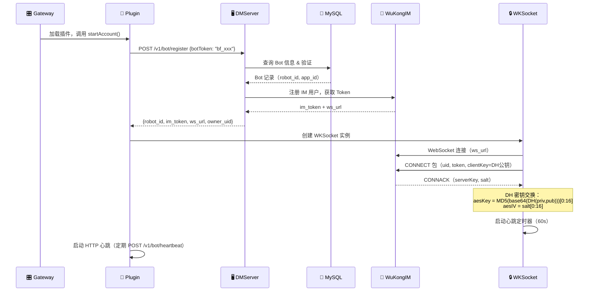
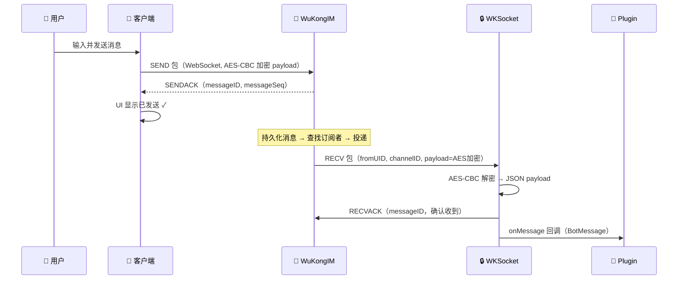
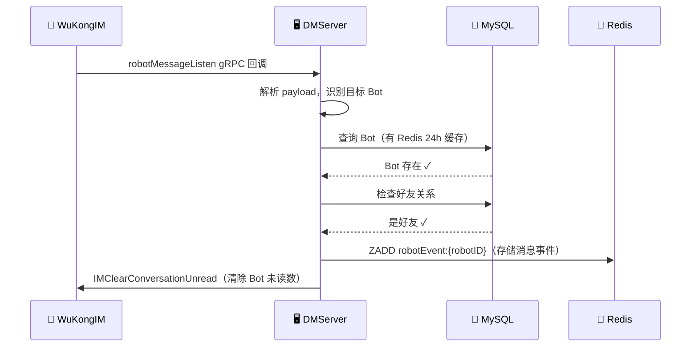
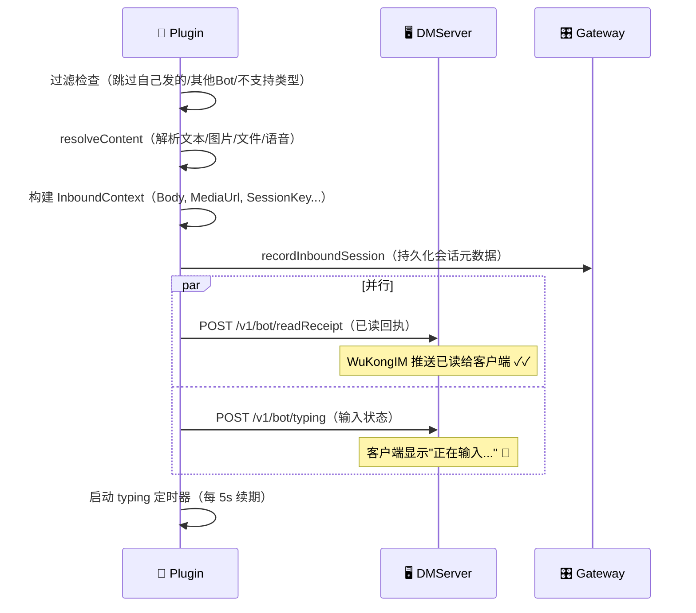
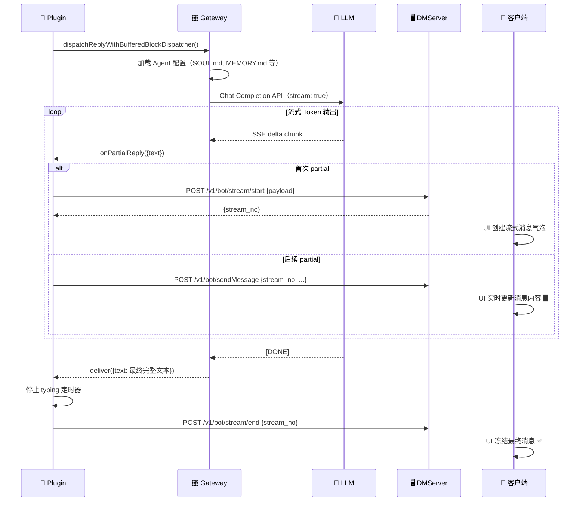
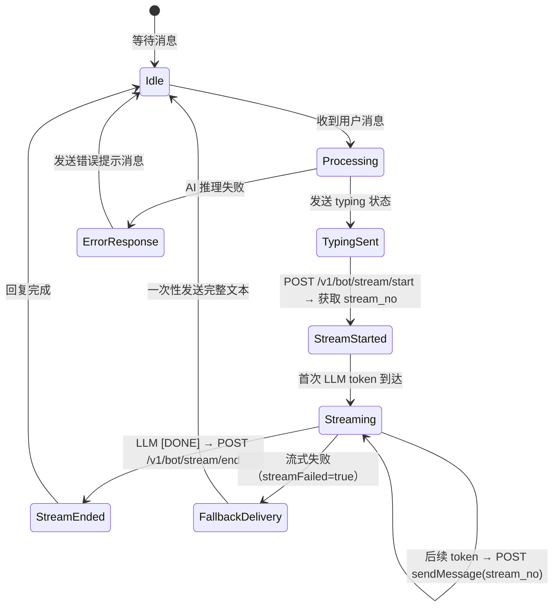
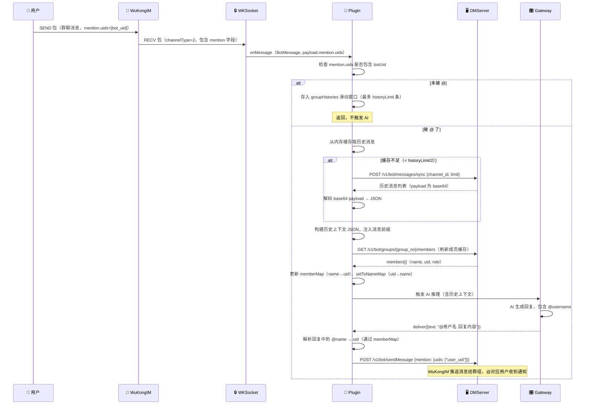
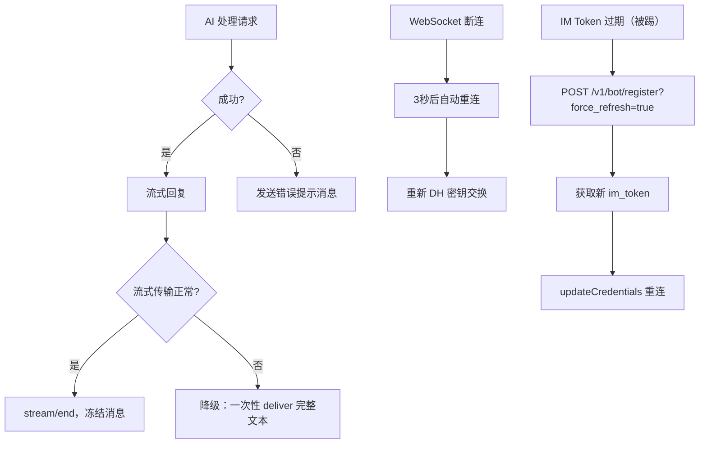

# 运行时视图

> 三个关键运行时场景：用户发消息给 Bot、Bot 流式回复、群聊 @mention 处理。

## 概述

本文档通过时序图描述三个核心运行时场景，展示消息在 Octo + OpenClaw 生态中的完整流转路径。

---

## 场景 1：用户发消息给 Bot（完整主流程）

这是最核心的场景，涵盖从用户发消息到 AI 回复的完整链路。

### 参与者

| 参与者 | 角色 |
|--------|------|
| 👤 Human User | 人类用户 |
| 📱 DMWork Client | Web/iOS/Android 客户端 |
| 🔌 WuKongIM | 底层 IM 通讯引擎 |
| 🖥️ DMWork Server | dmworkim 业务服务器 |
| 🔴 Redis | 缓存和事件队列 |
| 🐬 MySQL | 数据库 |
| 🦞 DMWork Plugin | openclaw-channel-dmwork |
| 🔒 WKSocket | WuKongIM WebSocket 客户端（DH+AES 加密） |
| 🎛️ OpenClaw Gateway | AI 助手控制面 |
| 🧠 LLM Provider | Claude/GPT/Gemini 等 |

### Phase 0：系统启动（Bot 注册 & WebSocket 连接）



### Phase 1-2：用户发消息 → WuKongIM 投递给 Bot



### Phase 3：业务层并行处理（DMWork Server）



### Phase 4-5：插件处理 + 已读/typing



### Phase 6-7：AI 推理 + 流式回复



---

## 场景 2：Bot 流式回复（详细）

聚焦流式消息协议的状态机：



### 流式消息关键参数

```
POST /v1/bot/stream/start
Body: {
  channel_id: "user_uid",
  channel_type: 1,           // 1=DM, 2=群聊
  payload: base64({
    type: 1,                 // ContentType: Text
    content: "首次文本"
  })
}
Response: { stream_no: "xxx-yyy" }

---

POST /v1/bot/sendMessage（流式续传）
Body: {
  channel_id: "user_uid",
  channel_type: 1,
  stream_no: "xxx-yyy",      // 关键：携带 stream_no
  payload: {
    type: 1,
    content: "累积文本..."    // 每次发完整累积文本（非 delta）
  }
}

---

POST /v1/bot/stream/end
Body: {
  stream_no: "xxx-yyy",
  channel_id: "user_uid",
  channel_type: 1
}
```

---

## 场景 3：群聊 @mention 处理

当用户在群聊中 @Bot 时的处理流程：



### @mention 双向解析

```
【入站解析（WuKongIM → AI）】
payload.mention.uids = ["user_uid_1", "user_uid_2"]
        ↓
uidToNameMap 查找 uid → name
        ↓
注入历史上下文时使用 @name 格式

【出站解析（AI → WuKongIM）】
AI 回复: "@张三 你好！"
        ↓
memberMap 查找 name → uid
        ↓
POST sendMessage { 
  content: "@张三 你好！",
  mention: { uids: ["uid_zhangsan"] }
}

【未解析时强制刷新】
GET /v1/bot/groups/{id}/members → 最新成员列表 → 重试解析
```

---

## 错误处理备选路径



---

## 相关页面

- [[架构概述]] — 全景架构
- [[上下文与边界]] — 系统边界
- [[Bot系统]] — Bot API 端点详情
- [[安全与加密]] — DH+AES 加密细节
- [[Space多租户]] — Space 场景下的频道路由

---

## CHANGELOG

| 版本 | 日期 | 变更说明 |
|------|------|----------|
| 0.1.0 | 2026-03-19 | 初始版本，三个核心运行时场景时序图 |
