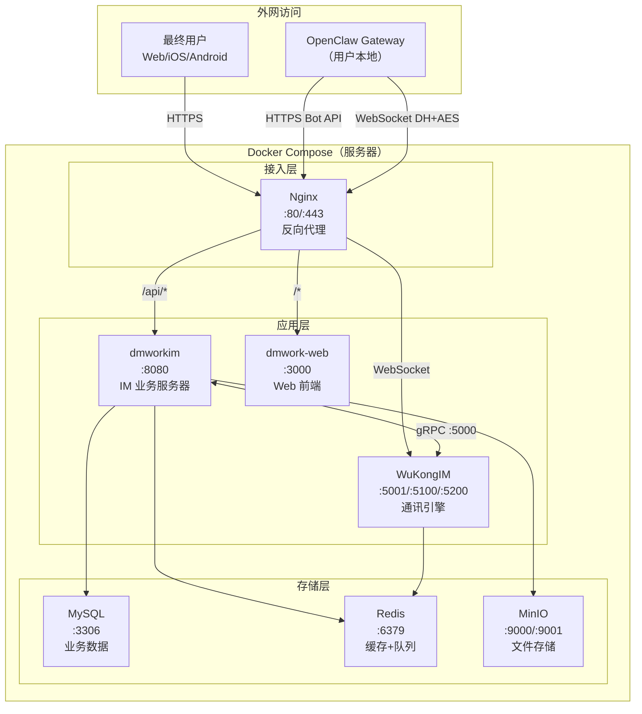
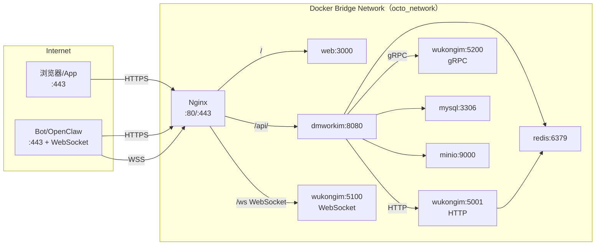

# 部署视图

> Docker Compose 一键部署：WuKongIM + dmworkim + MySQL + Redis + MinIO + Web，六个服务的网络拓扑。

## 概述

Octo 采用 Docker Compose 作为标准部署方案，所有核心服务容器化运行。OpenClaw Gateway 通常部署在用户本地设备（Mac mini、VPS 等），通过网络连接到 Octo 服务器。

---

## Docker Compose 服务组成



---

## 各服务详细配置

### 1. WuKongIM（底层 IM 引擎）

```yaml
services:
  wukongim:
    image: registry.cn-shenzhen.aliyuncs.com/wukongim/wukongim:latest
    ports:
      - "5001:5001"   # HTTP 管理 API
      - "5100:5100"   # WebSocket（客户端连接）
      - "5200:5200"   # gRPC（供 dmworkim 调用）
    volumes:
      - ./wukongim/data:/root/wukongim
    environment:
      - WK_MODE=release
      - WK_DATASOURCE_ADDR=dmworkim:8080   # 业务层地址（好友/群组校验）
```

**关键配置说明**：
- `:5001` — WuKongIM HTTP 管理 API，dmworkim 通过此接口管理频道/白名单
- `:5100` — WebSocket 端口，客户端（Web/iOS/Android）和 Bot 都连这里
- `:5200` — gRPC 端口，dmworkim 通过 gRPC 向 WuKongIM 发消息/管理频道

---

### 2. dmworkim（IM 业务服务器）

```yaml
services:
  dmworkim:
    image: registry.cn-shenzhen.aliyuncs.com/dmwork/dmworkim:latest
    ports:
      - "8080:8080"
    depends_on:
      - mysql
      - redis
      - wukongim
    volumes:
      - ./configs/tsdd.yaml:/etc/tsdd/tsdd.yaml
    environment:
      - DB_HOST=mysql:3306
      - REDIS_ADDR=redis:6379
      - WKIM_API_ADDR=http://wukongim:5001
      - WKIM_GRPC_ADDR=wukongim:5200
```

**关键配置（tsdd.yaml）**：

```yaml
# 数据库
db:
  mysql:
    addr: "mysql:3306"
    dbName: "tsdd"
    username: "root"
    password: "your_password"

# Redis
redis:
  addr: "redis:6379"

# WuKongIM 连接
wukongim:
  apiUrl: "http://wukongim:5001"
  grpcAddr: "wukongim:5200"

# 文件存储（选择其一）
storage:
  type: "minio"  # 或 oss, cos, seaweedfs
  minio:
    endpoint: "minio:9000"
    accessKey: "minioadmin"
    secretKey: "minioadmin"
    bucket: "tsdd"

# 推送服务（按需配置）
push:
  apns:
    certPath: "/etc/tsdd/apns.p12"
    password: "your_cert_password"
  mi:
    appId: "xxx"
    appKey: "xxx"
  hms:
    appId: "xxx"
    appKey: "xxx"
```

---

### 3. MySQL（业务数据库）

```yaml
services:
  mysql:
    image: mysql:8.0
    ports:
      - "3306:3306"
    environment:
      - MYSQL_ROOT_PASSWORD=your_password
      - MYSQL_DATABASE=tsdd
    volumes:
      - ./mysql/data:/var/lib/mysql
      - ./mysql/init:/docker-entrypoint-initdb.d
```

**数据规模**：
- 62 张表，覆盖 18 个业务模块
- 消息分片：`message_0` ~ `message_4`（按 `message_id % 5`）
- 迁移文件：88 个 SQL 迁移文件（通过 `rubenv/sql-migrate` 自动执行）

---

### 4. Redis（缓存 + 事件队列）

```yaml
services:
  redis:
    image: redis:7-alpine
    ports:
      - "6379:6379"
    volumes:
      - ./redis/data:/data
    command: redis-server --appendonly yes
```

**使用场景**：
- Bot 信息缓存（TTL 24h，避免频繁查 MySQL）
- 消息事件队列（`ZADD robotEvent:{robotID}`）
- 会话未读数缓存
- 在线状态（由 WuKongIM 管理）

---

### 5. MinIO（文件对象存储）

```yaml
services:
  minio:
    image: minio/minio:latest
    ports:
      - "9000:9000"   # S3 API
      - "9001:9001"   # 管理控制台
    volumes:
      - ./minio/data:/data
    environment:
      - MINIO_ROOT_USER=minioadmin
      - MINIO_ROOT_PASSWORD=minioadmin
    command: server /data --console-address ":9001"
```

**用途**：存储用户上传的图片、文件、语音、视频等媒体文件。

---

### 6. dmwork-web（前端）

```yaml
services:
  dmwork-web:
    image: registry.cn-shenzhen.aliyuncs.com/dmwork/dmwork-web:latest
    ports:
      - "3000:3000"
    environment:
      - REACT_APP_API_URL=https://your-domain.com/api
      - REACT_APP_WS_URL=wss://your-domain.com
```

---

## 网络拓扑



---

## 快速启动

```bash
# 1. 克隆配置
git clone https://github.com/dmwork-org/dmworkim.git
cd dmworkim

# 2. 复制配置文件
cp configs/tsdd.yaml.example configs/tsdd.yaml
# 编辑 tsdd.yaml，填写你的配置

# 3. 启动所有服务
docker compose up -d

# 4. 检查服务状态
docker compose ps
curl http://localhost:8080/v1/health

# 5. 查看日志
docker compose logs -f dmworkim
```

---

## 生产环境注意事项

| 关注点 | 建议 |
|--------|------|
| 数据库备份 | MySQL 定期 dump + Redis AOF 持久化 |
| TLS 证书 | Nginx + Let's Encrypt，所有外部接口走 HTTPS/WSS |
| MinIO | 生产环境建议使用阿里云 OSS 或腾讯云 COS，避免自运维 |
| 消息分片扩展 | 当前 5 分片（message_0~4），需要扩展时需数据迁移 |
| 推送配置 | APNs 证书有效期 1 年，需提前续期 |
| WuKongIM 版本 | 与 dmworkim 保持 API 版本兼容 |
| 监控 | 建议配置 `/v1/health` 健康检查 + 接入 Prometheus/Grafana |

---

## OpenClaw 部署（用户侧）

OpenClaw 通常部署在用户本地设备，不在 Docker Compose 中：

```bash
# macOS 推荐（Homebrew）
brew install openclaw

# 配置 dmwork 渠道
openclaw configure channels.dmwork.accounts.default.apiUrl "https://your-octo-server.com"
openclaw configure channels.dmwork.accounts.default.botToken "bf_your_token"

# 启动 Gateway
openclaw gateway start

# 安装为系统服务（开机自启）
openclaw gateway install
```

---

## 相关页面

- [[架构概述]] — 全景架构
- [[上下文与边界]] — 外部系统依赖
- [[快速开始]] — 开发环境搭建
- [[开发环境搭建]] — 详细开发环境配置
- [[推送系统]] — 推送服务配置详情
- [[Space多租户]] — Space 相关配置

---

## CHANGELOG

| 版本 | 日期 | 变更说明 |
|------|------|----------|
| 0.1.0 | 2026-03-19 | 初始版本，Docker Compose 部署视图 |
