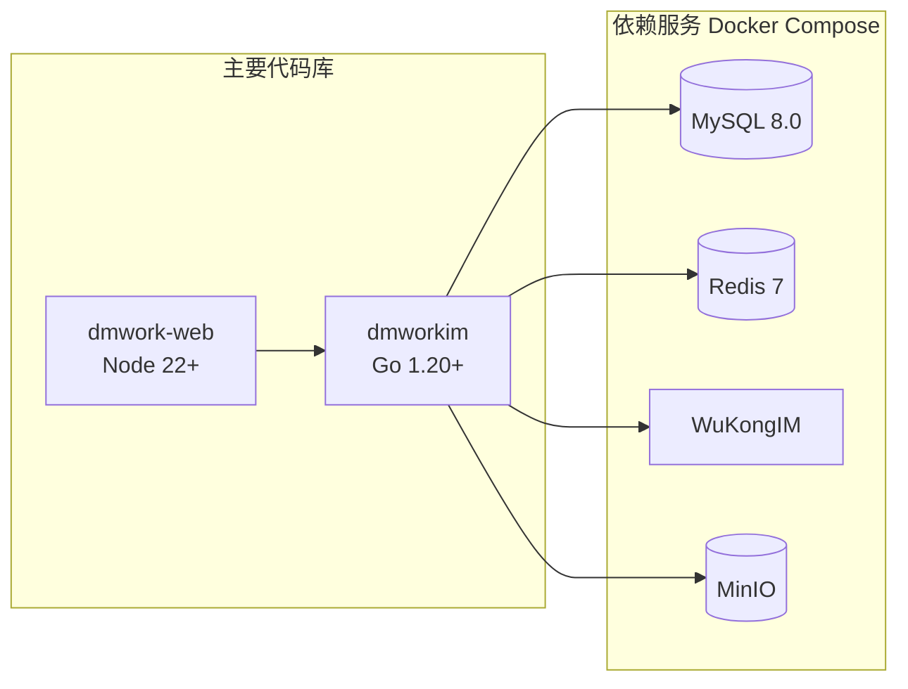

# 开发环境搭建

> 完整的本地开发环境配置指南，涵盖后端、前端、依赖服务和测试。

[[快速开始|← 快速开始]] | [[编码规范|编码规范 →]]

## 概述

DMWork 开发栈由四个依赖服务 + 两个主要代码库组成：



## 依赖服务（Docker Compose）

### 配置文件

`dmworkim` 提供了 `docker-compose.test.yml` 用于本地开发：

```yaml
# docker-compose.test.yml（简化版）
version: '3'
services:
  mysql:
    image: mysql:8.0
    environment:
      MYSQL_ROOT_PASSWORD: root
      MYSQL_DATABASE: dmwork
    ports:
      - "3306:3306"
    volumes:
      - mysql_data:/var/lib/mysql

  redis:
    image: redis:7
    ports:
      - "6379:6379"

  wukongim:
    image: ghcr.io/wukongim/wukongim:latest
    ports:
      - "5001:5001"   # HTTP API
      - "5100:5100"   # WebSocket
      - "5301:5301"   # gRPC
    environment:
      WK_MODE: debug

  minio:
    image: minio/minio
    command: server /data --console-address ":9001"
    ports:
      - "9000:9000"
      - "9001:9001"
    environment:
      MINIO_ROOT_USER: minioadmin
      MINIO_ROOT_PASSWORD: minioadmin

volumes:
  mysql_data:
```

### 常用命令

```bash
# 启动所有依赖服务
make env-test
# 等价于: docker-compose -f docker-compose.test.yml up -d

# 停止
docker-compose -f docker-compose.test.yml down

# 查看日志
docker-compose -f docker-compose.test.yml logs -f wukongim

# 重置（清除数据）
docker-compose -f docker-compose.test.yml down -v
```

### 服务端口速查

| 服务 | 端口 | 用途 |
|------|------|------|
| MySQL | 3306 | 数据库 |
| Redis | 6379 | 缓存/会话 |
| WuKongIM HTTP | 5001 | Bot API、管理接口 |
| WuKongIM WebSocket | 5100 | IM 消息连接 |
| WuKongIM gRPC | 5301 | Webhook 回调 |
| MinIO API | 9000 | 对象存储 |
| MinIO Console | 9001 | 管理界面 |

## Go 后端环境（dmworkim）

### 安装 Go

```bash
# macOS (Homebrew)
brew install go

# 验证
go version  # go1.20+

# 设置 GOPATH
export GOPATH=$HOME/go
export PATH=$PATH:$GOPATH/bin
```

### 拉取依赖

```bash
cd dmworkim
go mod download
```

**核心依赖**：

| 依赖 | 用途 |
|------|------|
| `gin-gonic/gin` | HTTP 框架 |
| `gocraft/dbr` | MySQL ORM（SQL Builder 风格） |
| `go-redis/redis` | Redis 客户端 |
| `spf13/viper` | 配置文件管理 |
| `rubenv/sql-migrate` | SQL 迁移 |
| `uber-go/zap` | 日志 |
| `opentracing/opentracing-go` | 分布式链路追踪 |
| `judwhite/go-svc` | 系统服务管理（信号处理） |

### 运行测试

```bash
# 所有测试（需要依赖服务运行中）
make test
# 等价于: go test ./...

# 单个包测试
go test ./modules/botfather/... -v

# 带覆盖率
go test ./... -coverprofile=coverage.out
go tool cover -html=coverage.out
```

### 开发调试

```bash
# 开发模式（带 race detector）
go run -race main.go

# 热重载（需安装 air）
go install github.com/air-verse/air@latest
air  # 读取 .air.toml 配置
```

### SQL 迁移管理

每个模块在 `sql/` 目录下维护自己的迁移文件：

```
modules/user/
└── sql/
    ├── 000001_user.sql
    ├── 000002_add_email.sql
    └── ...
```

迁移在服务启动时**自动执行**（`module.Setup()` 内调用 `sql-migrate`），无需手动操作。

## Node.js 前端环境（dmwork-web）

### 安装 Node.js

```bash
# 推荐使用 nvm 管理版本
curl -o- https://raw.githubusercontent.com/nvm-sh/nvm/v0.39.7/install.sh | bash
nvm install 22
nvm use 22

# 验证
node --version  # v22+
```

### 安装依赖

```bash
cd dmwork-web

# Yarn 1.22（项目要求）
npm install -g yarn@1.22
yarn install
```

### 开发启动

```bash
# 启动所有包的 dev 模式（Turborepo 并行）
yarn dev
# 或
turbo dev

# 只启动主 App
cd apps/web && yarn start

# 访问
open http://localhost:3000
```

### 构建

```bash
# Web 构建
yarn build

# Electron 桌面端（macOS）
yarn build-ele:mac

# Electron 桌面端（Windows）
yarn build-ele:win
```

### 前端测试

```bash
# 单元测试
yarn test

# E2E 测试（Playwright）
cd e2e
npx playwright test
```

## dmwork-adapters 开发环境

### 安装

```bash
cd dmwork-adapters

# openclaw-channel-dmwork
cd packages/openclaw-channel-dmwork
npm install
npm run build

# claude-code-dmwork-ws
cd packages/claude-code-dmwork-ws
npm install
npm run build
```

### TypeScript 编译

```bash
# 监听模式（边改边编译）
npm run dev
# 等价于: tsc --watch
```

## IDE 推荐配置

### VS Code

```json
// .vscode/settings.json
{
  "go.toolsManagement.checkForUpdates": "local",
  "go.useLanguageServer": true,
  "editor.formatOnSave": true,
  "[go]": {
    "editor.defaultFormatter": "golang.go"
  },
  "[typescript]": {
    "editor.defaultFormatter": "esbenp.prettier-vscode"
  }
}
```

推荐插件：
- `golang.go`（Go 官方）
- `esbenp.prettier-vscode`（TypeScript 格式化）
- `dbaeumer.vscode-eslint`（ESLint）
- `bradlc.vscode-tailwindcss`（如使用 Tailwind）

## 相关页面

- [[快速开始|03-开发指南/快速开始]]
- [[编码规范|03-开发指南/编码规范]]
- [[Docker配置|10-运维/Docker配置]]
- [[故障排查|10-运维/故障排查]]

## CHANGELOG

| 版本 | 日期 | 变更 |
|------|------|------|
| 0.1.0 | 2026-03-19 | 初始版本，基于 CLAUDE.md 和 docker-compose 分析 |
