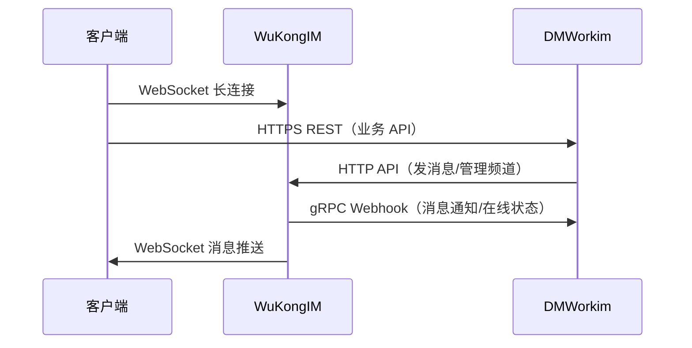
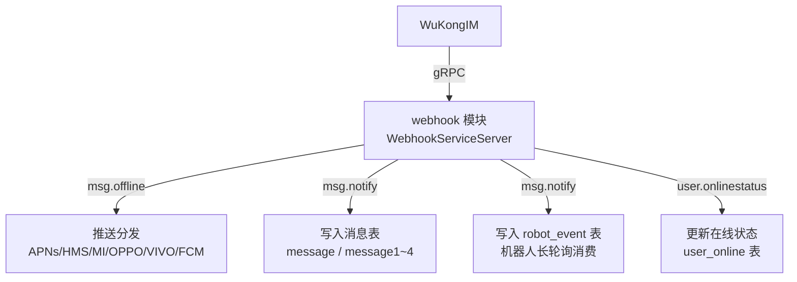

# WuKongIM 集成

DMWorkim 与 WuKongIM 之间通过 **HTTP REST API（上行）** 和 **gRPC Webhook（下行）** 双通道交互。

## 交互模型



## 上行：DMWorkim → WuKongIM HTTP API

所有 HTTP 调用均封装在 `dmwork-lib` 的 `config/msg.go` 中，通过 `Context` 方法调用。

### 消息操作

| 方法 | WuKongIM API | 说明 |
|------|------|------|
| `SendMessage(req)` | `POST /message/send` | 发送单条消息 |
| `SendMessageBatch(req)` | `POST /message/sendbatch` | 批量发送消息 |
| `SendCMD(req)` | `POST /message/send`（CMD 类型） | 发送控制指令消息 |
| `SendTyping(...)` | `POST /message/typing` | 发送正在输入状态 |
| `SendRevoke(req)` | `POST /message/revoke` | 撤回消息 |
| `SendFriendApply(...)` | `POST /message/send` | 好友申请消息 |
| `SendFriendSure(...)` | `POST /message/send` | 好友确认消息 |
| `SendFriendDelete(...)` | `POST /message/send` | 好友删除消息 |

### 频道管理

| 方法 | 说明 |
|------|------|
| `IMCreateOrUpdateChannel(req)` | 创建或更新频道（群组创建时调用） |
| `IMAddSubscriber(channelID, type, uids)` | 添加频道订阅者（加群） |
| `IMRemoveSubscriber(channelID, type, uids)` | 移除频道订阅者（退群/踢人） |
| `IMDelChannel(req)` | 删除频道（群解散） |
| `IMBlacklistAdd/Remove/Set(...)` | 黑名单管理 |
| `IMWhitelistAdd/Remove/Set(...)` | 白名单管理 |

### 会话与消息查询

| 方法 | 说明 |
|------|------|
| `IMGetConversations(uid)` | 获取用户最近会话列表 |
| `IMSyncUserConversation(...)` | 同步会话数据 |
| `IMClearConversationUnread(req)` | 清除未读数 |
| `IMSyncChannelMessage(req)` | 同步频道消息 |
| `IMGetChannelMaxSeq(...)` | 获取频道最大消息序号 |
| `IMSearchMessages(req)` | 搜索消息 |

### 用户认证与状态

| 方法 | 说明 |
|------|------|
| `UpdateIMToken(req)` | 更新用户 IM Token（登录认证用） |
| `IMSOnlineStatus(uids)` | 批量查询用户在线状态 |
| `QuitUserDevice(uid, deviceFlag)` | 踢下线 |

### 流式消息（AI 场景）

```go
// 开始流式消息
IMStreamStart(req) → 返回 stream_no

// 结束流式消息（触发客户端合并显示）
IMStreamEnd(req)
```

流式消息通过 `/streammessage/start` 和 `/streammessage/end` API 实现，客户端看到逐字渐出效果。

## 下行：WuKongIM → DMWorkim gRPC Webhook

WuKongIM 通过 **gRPC** 将事件下行推送给 DMWorkim，由 [[模块/webhook|webhook 模块]] 实现 gRPC Server。

### gRPC 服务定义

```protobuf
// pkg/wkhook/webhook.proto
service WebhookService {
    rpc Webhook(stream WebhookReq) returns (WebhookResp);
}
```

`webhook_grpc.pb.go` 和 `webhook.pb.go` 由 protoc 生成，webhook 模块实现 `WebhookServiceServer` 接口。

### Webhook 事件类型

| 事件标识 | 说明 |
|---------|------|
| `msg.offline` | 离线消息通知（触发推送） |
| `user.onlinestatus` | 用户在线状态变更 |
| `msg.notify` | 全量消息通知（写入消息存储） |

### 消息接收流程



### 安全签名验证

WuKongIM → DMWorkim 的请求通过 HMAC-SHA256 验签：

```
Header: X-Signature-256: sha256=<hex(HMAC-SHA256(body, secretKey))>
配置项: webhookSecretKey（空字符串=不验证）
```

## 数据源回调（Datasource）

WuKongIM 在消息投递时会**回调查询**业务数据（如群成员列表、黑名单等），通过 HTTP POST 回调实现：

| 端点 | 说明 |
|------|------|
| `POST /v1/datasource` | WuKongIM 查询订阅者、黑白名单、频道详情等 |

业务模块通过 `register.Module.IMDatasource` 接口向框架注册数据提供能力：

```go
type IMDatasource interface {
    GetSubscribers(channelID string, channelType uint8) ([]string, error)
    GetBlacklist(channelID string, channelType uint8) ([]string, error)
    GetWhitelist(channelID string, channelType uint8) ([]string, error)
}
```

## Space 频道 ID 规范

Space 模式下的频道 ID 有特殊前缀：

```
普通频道：{peer_id}
Space 内频道：s{space_id}_{peer_id}
```

`pkg/space/channel.go` 实现 `BuildChannelID` 和 `ParseChannelID`，启动时从 DB 加载所有有效 SpaceID（`RegisterSpaceIDs()`），解析时用最长前缀匹配。

## WuKongIM 配置

```yaml
# configs/tsdd.yaml
wukongim:
  apiurl: "http://127.0.0.1:5001"  # WuKongIM 管理 API 地址
  manager_token: ""                 # 管理者 Token
  
grpc_addr: "0.0.0.0:6979"          # DMWorkim gRPC 监听地址（WuKongIM 回调用）
```

## 相关页面

- [[概述]] — 服务端整体架构
- [[核心库/概述]] — dmwork-lib 封装详情
- [[模块/webhook]] — webhook 模块详解
- [[../05-适配层/协议/WuKongIM二进制协议]] — 客户端侧协议实现

---

## CHANGELOG

| 版本 | 日期 | 作者 | 变更 |
|------|------|------|------|
| 0.1.0 | 2026-03-19 | 戏精 | 初始创建 |
