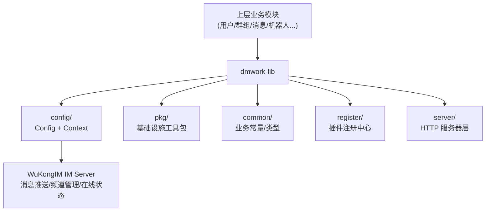

# dmwork-lib 核心库概述

`dmwork-lib`（`github.com/dmwork-org/dmwork-lib`）是 DMWork 平台的 **Go 核心基础库**，为所有上层业务模块提供统一的基础设施支撑。

## 核心职能

| 职能 | 说明 |
|------|------|
| **配置管理中心** | `Config` struct 集中管理所有外部服务配置 |
| **应用上下文容器** | `Context` 持有所有基础设施依赖（IoC 容器） |
| **工具包集合** | 加密、缓存、日志、HTTP、数据库等工具包 |
| **模块注册系统** | `register.Module` 插件式模块注册 |
| **WuKongIM 集成** | 封装 WuKongIM REST API 全套调用 |

## 整体架构



## 配置中心（Config）

`Config` struct 通过 `viper` 读取 YAML 配置文件，支持环境变量（`TS_` 前缀）覆盖。

### 关键配置分组

| 分组 | 说明 |
|------|------|
| 基础配置 | `Mode`、`AppID`、`Addr`、`GRPCAddr`、`RootDir` |
| External | 外网 IP、`BaseURL`、`H5BaseURL`、`APIBaseURL` |
| DB | MySQL 地址、连接池、Redis 地址、AsynctaskRedis |
| Cache | Token 前缀和过期时间、好友申请过期时间 |
| WuKongIM | `APIURL`、`ManagerToken` |
| Push | APNs、小米、华为、VIVO、OPPO、Firebase 推送配置 |
| TablePartition | 消息分片数（5）、用户消息扩展分片数（3）、频道偏移分片数（3） |

### 关键方法

```go
GetAvatarPath(uid string) string              // 计算用户头像存储路径
GetGroupAvatarFilePath(groupNo string) string // CRC32 分区计算群头像路径
IsVisitorChannel(uid string) bool             // 判断访客频道（@ht 结尾）
ComposeCustomerServiceChannelID(vid, channelID string) string
```

## 上下文容器（Context）

`Context` 是应用的依赖注入容器，持有所有基础设施的单例（懒加载 + `sync.Once`）：

| 字段 | 类型 | 说明 |
|------|------|------|
| `cfg` | `*Config` | 配置引用 |
| `mySQLSession` | `*dbr.Session` | MySQL 数据库会话 |
| `redisCache` | `*common.RedisCache` | Redis 缓存 |
| `memoryCache` | `cache.Cache` | 内存缓存 |
| `EventPool` | `pool.Collector` | 通用事件协程池 |
| `PushPool` | `pool.Collector` | 离线推送协程池 |
| `RobotEventPool` | `pool.Collector` | 机器人事件协程池 |
| `Event` | `wkevent.Event` | 事件总线接口 |
| `UserIDGen` | `*snowflake.Node` | 雪花算法 ID 生成器 |
| `tracer` | `*Tracer` | Jaeger 分布式追踪 |
| `timingWheel` | `*timingwheel.TimingWheel` | 时间轮延迟任务 |

### 监听器系统（观察者模式）

```go
// 三类全局监听器（线程安全，sync.RWMutex）
ctx.AddOnlineStatusListener(func(uid string, online bool) { ... })
ctx.AddEventListener("userOnline", func(data []byte, commit EventCommit) { ... })
ctx.AddMessagesListener(func(msgs []Message) { ... })
```

## 消息模型

```go
// 消息发送请求
type MsgSendReq struct {
    Header      MsgHeader   // 控制持久化/红点/同步模式
    Setting     uint8       // 位字段（已读回执/不更新会话/Signal加密）
    FromUID     string      // 模拟发送者UID
    ChannelID   string
    ChannelType uint8
    StreamNo    string      // 流式消息编号
    Subscribers []string    // 指定接收者（空=发给频道所有人）
    Payload     []byte      // JSON序列化的消息正文
}

// 消息头
type MsgHeader struct {
    NoPersist int // 1=不持久化
    RedDot    int // 1=显示红点
    SyncOnce  int // 1=写扩散，0=读扩散
}
```

## 消息内容类型（ContentType）

```
文本=1  图片=2  GIF=3  语音=4  视频=5  位置=6  名片=7  文件=8
合并转发=11  矢量贴图=12  Emoji贴图=13  富文本=14  CMD=99
好友申请=1000  群创建=1001  ...（1000+ 系统消息）
音视频通话=9989
```

## 频道类型（ChannelType）

| 值 | 类型 |
|----|------|
| 1 | 个人（单聊） |
| 2 | 群组 |
| 3 | 客服 |
| 4 | 社区 |
| 5 | 话题 |
| 6 | 资讯 |

## WuKongIM API 封装（msg.go）

`Context` 内置对 WuKongIM REST API 的完整封装：

| 类别 | 方法 |
|------|------|
| 消息操作 | `SendMessage`、`SendMessageBatch`、`SendCMD`、`SendTyping`、`SendRevoke` |
| 好友操作 | `SendFriendApply`、`SendFriendSure`、`SendFriendDelete` |
| 频道管理 | `IMCreateOrUpdateChannel`、`IMAddSubscriber`、`IMRemoveSubscriber` |
| 黑白名单 | `IMBlacklistAdd/Remove/Set`、`IMWhitelistAdd/Remove/Set` |
| 会话管理 | `IMGetConversations`、`IMSyncUserConversation`、`IMClearConversationUnread` |
| 消息查询 | `IMSyncChannelMessage`、`IMGetChannelMaxSeq`、`IMSearchMessages` |
| 在线状态 | `IMSOnlineStatus`、`UpdateIMToken`、`QuitUserDevice` |
| 流式消息 | `IMStreamStart`、`IMStreamEnd` |

## 工具包详解（pkg/）

| 包 | 功能 |
|----|------|
| `pkg/util/dh.go` | Curve25519 ECDH 密钥交换 |
| `pkg/util/aes.go` | AES-CBC 加解密（PKCS5/PKCS7） |
| `pkg/util/base62.go` | Base62 编码（短链/邀请码） |
| `pkg/util/sign.go` | HMAC-SHA256 签名验证 |
| `pkg/util/uuid.go` | UUID v4 生成 |
| `pkg/cache/cache.go` | 缓存接口（Redis 实现 + 内存实现） |
| `pkg/pool/dispatcher.go` | Goroutine 工作池（基于 ants） |
| `pkg/keylock/keylock.go` | Key 级别互斥锁（防并发竞争） |
| `pkg/wkhook/` | Webhook gRPC 接口定义（webhook.proto） |
| `pkg/wkhttp/http.go` | Gin 封装（AuthMiddleware、JWT 鉴权） |
| `pkg/wkevent/event.go` | 事件总线接口（两步式事务安全设计） |
| `pkg/log/logger.go` | Zap 结构化日志（lumberjack 滚动） |
| `pkg/space/channel.go` | Space Channel ID 工具（前缀解析） |
| `pkg/wkrsa/rsa.go` | RSA 公私钥加解密 |
| `pkg/markdown/` | Markdown 转 HTML |
| `pkg/redis/redis.go` | Redis 全功能封装（String/Hash/List/Set/ZSet/Geo） |

## 分布式序列号（seq.go）

```go
// 批量预申请策略（步长 1000），减少 DB 写入压力
GenSeq(flag string) (int64, error)

// 序列号 Key 常量
GroupMemberSeqKey = "groupMember"
GroupSeqKey       = "group"
UserSeqKey        = "user"
MessageExtraSeqKey = "messageExtra"
RobotSeqKey       = "robot"
```

## 模块注册（register/）

```go
type Module struct {
    Name           string
    SetupAPI       func() APIRouter      // HTTP 路由注册
    SetupTask      func() TaskRouter     // 异步任务注册
    SQLDir         *SQLFS                // embedded SQL 迁移文件
    Swagger        string                // Swagger JSON
    IMDatasource   IMDatasource          // IM 数据源回调
    BussDataSource BussDataSource        // 业务数据源回调
    Service        interface{}           // 模块暴露的服务接口
    Start          func() error
    Stop           func() error
}
```

## 技术栈

| 组件 | 技术 | 版本 |
|------|------|------|
| 配置 | spf13/viper | v1.16 |
| HTTP | gin-gonic/gin | v1.9 |
| ORM | gocraft/dbr | v2.7 |
| Redis | go-redis/redis | v6.15 |
| 日志 | go.uber.org/zap | v1.24 |
| 协程池 | panjf2000/ants | v2.10 |
| ID 生成 | bwmarrin/snowflake | v0.3 |
| 异步任务 | RichardKnop/machinery | v2 |
| 时间轮 | RussellLuo/timingwheel | — |
| 追踪 | opentracing-go + jaeger-client-go | — |
| 加密 | golang.org/x/crypto (curve25519) | — |

## 相关页面

- [[../概述]] — 服务端整体架构
- [[../WuKongIM集成]] — WuKongIM 集成详解
- [[../模块/webhook]] — gRPC Webhook 模块

---

## CHANGELOG

| 版本 | 日期 | 作者 | 变更 |
|------|------|------|------|
| 0.1.0 | 2026-03-19 | 戏精 | 初始创建 |
