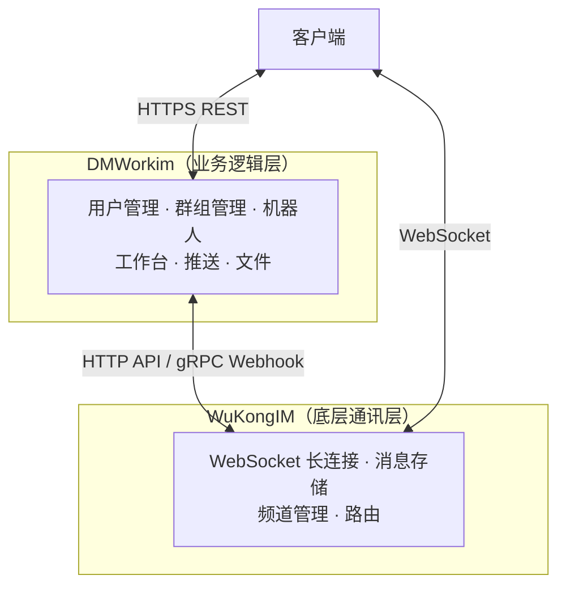
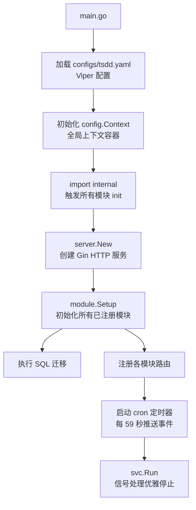
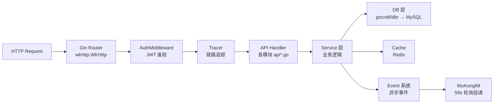

# 服务端概述

## 产品定位

**DMWork（唐僧叨叨 / TangSengDaoDao）** 是面向 AI Agent 时代的企业级即时通讯平台，服务端由两层构成：

| 层 | 项目 | 职责 |
|----|------|------|
| 业务逻辑层 | **dmworkim** | 用户管理、群组、机器人、工作台、推送、文件 |
| 底层通讯层 | **WuKongIM** | WebSocket 长连接、消息存储、频道管理、路由 |

核心库 **[[核心库/概述|dmwork-lib]]** 提供配置管理、依赖注入容器、工具包和模块注册系统，被 dmworkim 所有业务模块共享。

## 双层架构



**设计意图**：
- 通讯协议的复杂性（连接管理、消息路由、离线队列）由 WuKongIM 承担
- 业务逻辑（用户身份、群组权限、机器人事件）由 dmworkim 承担
- 两层通过 HTTP API（上行）和 gRPC Webhook（下行通知）交互

## 启动流程



## 模块注册机制

每个业务模块遵循标准注册模式：

```go
// modules/xxx/1module.go
func init() {
    register.AddModule(func(ctx interface{}) register.Module {
        return register.Module{
            Name:     "xxx",
            SetupAPI: func() register.APIRouter { return New(ctx.(*config.Context)) },
            SQLDir:   register.NewSQLFS(sqlFS),  // embed SQL 迁移文件
            Swagger:  swaggerContent,             // embed OpenAPI 文档
            Service:  NewService(ctx),            // 跨模块服务注册（可选）
            Start:    func() error { ... },       // 模块启动钩子（可选）
            Stop:     func() error { ... },       // 模块停止钩子（可选）
        }
    })
}
```

`internal/modules.go` 通过空白导入触发所有 **17 个可注册模块** 的 `init()`，实现自动注册：

> `base` · `botfather` · `channel` · `common` · `file` · `group` · `message` · `openapi` · `qrcode` · `report` · `robot` · `search` · `space` · `statistics` · `user` · `webhook` · `workplace`

另有 **source** 作为纯 Go 工具包（无路由注册，解决循环依赖）。

## 请求处理流程



## 事件系统

事件系统是模块间异步通信的核心：

| 阶段 | 操作 | 说明 |
|------|------|------|
| 发布 | `Event.Begin()` | 业务逻辑将事件写入 `event` 表，状态为 `Wait` |
| 投递 | cron 59s | `ev.EventTimerPush()` 批量读取待处理事件 |
| 处理 | `handler.go` | 事件类型 → 处理函数映射表 |

核心事件常量：

| 事件标识 | 含义 |
|---------|------|
| `group.create` | 群组创建 |
| `group.memberadd` | 群成员添加 |
| `group.memberremove` | 群成员移除 |
| `group.disband` | 群解散 |
| `friend.apply` / `friend.sure` / `friend.delete` | 好友操作 |
| `user.register` | 用户注册 |
| `space.member.join` | 用户加入空间 |

## 技术栈核心

| 组件 | 技术 |
|------|------|
| 语言 | Go 1.20 |
| Web 框架 | Gin（自定义封装为 `wkhttp.WKHttp`） |
| ORM | gocraft/dbr（轻量 SQL Builder） |
| 数据库 | MySQL |
| 缓存 | Redis（go-redis v6） |
| 配置 | Viper（YAML + `TS_` 前缀环境变量覆盖） |
| 日志 | Zap |
| 链路追踪 | OpenTracing + Jaeger |
| SQL 迁移 | rubenv/sql-migrate |
| gRPC | google.golang.org/grpc v1.57 |

## 相关页面

- [[核心库/概述]] — dmwork-lib 核心库详解
- [[WuKongIM集成]] — gRPC/HTTP 与 WuKongIM 的交互
- [[模块/user]] · [[模块/group]] · [[模块/message]] · [[模块/robot]] · [[模块/botfather]]
- [[模块/space]] · [[模块/webhook]] · [[模块/workplace]]

---

## CHANGELOG

| 版本 | 日期 | 作者 | 变更 |
|------|------|------|------|
| 0.1.0 | 2026-03-19 | 戏精 | 初始创建 |
