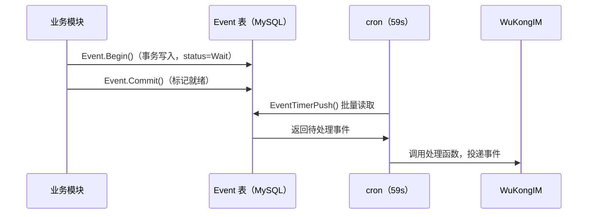

# base 模块

## 功能职责

基础应用管理模块，提供两大核心能力：
1. **App 配置查询** — 提供 App 身份信息的查询接口
2. **事件系统实现** — 整个平台异步事件系统的核心实现

> 注意：base 模块是最简化的注册形式，没有设置 `Name` 字段，也没有注册 Service 或 Swagger。

## 目录结构

```
modules/base/
├── app/         — App 信息 API 与 Service
├── event/       — 事件系统核心（事件处理器、DB、常量定义）
├── common/      — 基础公用逻辑
└── elastic/     — Elasticsearch 搜索服务集成
```

## API 端点表

| 方法 | 路径 | 描述 | 鉴权 |
|------|------|------|------|
| GET | `/v1/apps/:app_id` | 获取 App 信息 | 无 |

## 事件处理器（handler.go）

base 模块注册了对以下事件的处理逻辑：

| 事件标识 | 处理动作 |
|---------|---------|
| `group.create` | 发送群创建系统消息给 WuKongIM |
| `group.memberremove` | 发送群成员移除消息 |
| `group.update` | 发送群更新消息 |
| `group.avatar.update` | 群头像更新通知 |
| `group.member.transfer.grouper` | 群主转让通知 |
| `group.member.invite` | 群邀请请求处理 |

## 关键数据模型

### event 表

| 字段 | 类型 | 说明 |
|------|------|------|
| `id` | integer PK | 自增主键 |
| `event` | VARCHAR(40) | 事件标识 |
| `type` | smallint | 事件类型（None/Message/CMD） |
| `data` | VARCHAR(10000) | 事件数据（JSON） |
| `status` | smallint | 0=待发布 1=已发布 2=失败 |
| `version_lock` | integer | 乐观锁 |

### app 表

| 字段 | 类型 | 说明 |
|------|------|------|
| `app_id` | VARCHAR(40) UNIQUE | App ID |
| `app_key` | VARCHAR(40) | App Key（密钥） |
| `app_name` | VARCHAR(40) | App 名称 |
| `app_logo` | VARCHAR(400) | App Logo URL |
| `status` | integer | 0=禁用 1=可用 |

## 事件系统架构



两步式设计保证原子性：`Begin` 在 DB 事务中写入，`Commit` 在事务提交后标记为可投递。

## 相关模块

- [[webhook]] — 接收 WuKongIM 下行事件
- [[group]] — group.create / memberadd 等事件发布者
- [[user]] — user.register 事件发布者

## 相关数据库表

- `app` — App 身份表
- `event` — 事件发布队列

---

## CHANGELOG

| 版本 | 日期 | 作者 | 变更 |
|------|------|------|------|
| 0.1.0 | 2026-03-19 | 戏精 | 初始创建 |
