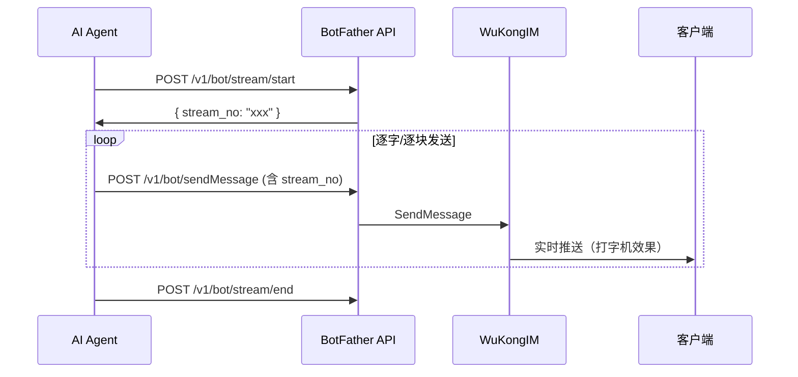

# botfather 模块

## 功能职责

BotFather 是 AI Bot 的**创建与管理中枢**，参考 Telegram BotFather 设计：

- Bot 自注册（第三方 AI 服务通过 API Key 注册）
- Bot Token 管理（`bf_` 前缀）
- Bot 消息发送、事件获取（长轮询 or REST）
- **流式消息支持**（AI 逐字输出场景）
- Bot 与用户/群组的交互（消息、typing、阅读回执）
- 群组管理代理（Bot 可查询所在群组和成员）
- 命令（Commands）系统
- 用户自建 Bot
- Bot 申请加好友流程

## API 端点表

### Bot 核心接口

| 方法 | 路径 | 描述 | 鉴权 |
|------|------|------|------|
| GET | `/v1/bot/skill.md` | 获取 Bot 技能描述文档 | 无 |
| POST | `/v1/bot/register` | Bot 自注册 | 无 |
| POST | `/v1/bot/sendMessage` | Bot 发送消息 | Bot Token |
| POST | `/v1/bot/typing` | Bot 输入状态 | Bot Token |
| POST | `/v1/bot/readReceipt` | Bot 阅读回执 | Bot Token |
| POST | `/v1/bot/events` | 获取事件（长轮询） | Bot Token |
| POST | `/v1/bot/events/:event_id/ack` | 事件确认 | Bot Token |
| POST | `/v1/bot/stream/start` | 流式消息开始 | Bot Token |
| POST | `/v1/bot/stream/end` | 流式消息结束 | Bot Token |
| POST | `/v1/bot/heartbeat` | Bot 心跳 | Bot Token |
| POST | `/v1/bot/messages/sync` | 同步历史消息（POST） | Bot Token |
| GET | `/v1/bot/groups` | Bot 获取所在群组列表 | Bot Token |
| GET | `/v1/bot/groups/:group_no` | Bot 获取群组信息 | Bot Token |
| GET | `/v1/bot/groups/:group_no/members` | Bot 获取群成员 | Bot Token |
| POST | `/v1/bot/setCommands` | 设置 Bot 命令列表 | Bot Token |

### Bot 文件接口

| 方法 | 路径 | 描述 | 鉴权 |
|------|------|------|------|
| POST | `/v1/bot/file/upload` | Bot 上传文件 | Bot Token |
| POST | `/v1/bot/upload` | Bot 上传文件（兼容旧路径） | Bot Token |
| GET | `/v1/bot/file/download/*path` | Bot 文件下载 | Bot Token |
| GET | `/v1/botfile/*path` | Bot 文件代理访问 | 无 |
| POST | `/v1/botfile/upload` | Bot 文件代理上传 | 无 |

### 用户自建 Bot

| 方法 | 路径 | 描述 | 鉴权 |
|------|------|------|------|
| POST | `/v1/user/bots` | 创建用户 Bot | 用户 JWT |
| GET | `/v1/user/bots` | 列出用户的 Bot | 用户 JWT |
| PUT | `/v1/user/bots/:bot_id` | 更新用户 Bot | 用户 JWT |
| DELETE | `/v1/user/bots/:bot_id` | 删除用户 Bot | 用户 JWT |
| GET | `/v1/user/bots/:bot_id/token` | 获取用户 Bot Token | 用户 JWT |

### Bot 好友申请（注意：路由在 /v1/robot/ 下）

> ⚠️ **CORRECTED**: 以下路由实际注册在 `/v1/robot/` 前缀下，而非 `/v1/bot/`

| 方法 | 路径 | 描述 | 鉴权 |
|------|------|------|------|
| POST | `/v1/robot/apply` | Bot 申请加好友 | 用户 JWT |
| POST | `/v1/robot/apply/sure` | 确认 Bot 申请 | 用户 JWT |
| PUT | `/v1/robot/apply/refuse/:apply_id` | 拒绝 Bot 申请 | 用户 JWT |
| GET | `/v1/robot/applies` | Bot 申请列表 | 用户 JWT |

## 鉴权方式

BotFather 使用 `Authorization: Bearer {bot_token}` Header 鉴权：

```go
func extractBotToken(c *wkhttp.Context) string {
    auth := c.GetHeader("Authorization")
    if strings.HasPrefix(auth, "Bearer ") {
        return strings.TrimPrefix(auth, "Bearer ")
    }
    return ""
}
```

## 关键数据模型

```go
// Bot 注册响应
BotRegisterResp {
    RobotID, IMToken, WSURL, APIURL, OwnerUID, OwnerChannelID
}

// Bot 发送消息请求
BotSendMessageReq {
    ChannelID, ChannelType, StreamNo, Payload map[string]interface{}
}

// Bot 事件请求
BotEventsReq { EventID int64, Limit int64 }

// 流式消息控制
BotStreamStartReq { ChannelID, ChannelType, Payload []byte }
BotStreamEndReq { StreamNo, ChannelID, ChannelType }

// 同步历史消息
BotSyncMessagesReq {
    ChannelID, ChannelType, StartMessageSeq, EndMessageSeq, Limit, PullMode
}
```

## 流式消息协议



## 与 Robot 模块对比

| 维度 | BotFather 模块 | [[robot|Robot 模块]] |
|------|-------------|-----------|
| 目标用户 | AI Agent / SDK 接入 | 传统机器人 / Webhook |
| 认证方式 | `Authorization: Bearer {bot_token}` | 路径参数 `robot_id + app_key` |
| 用户自建 | ✅ `/v1/user/bots` | ❌ 仅管理员 |
| 申请好友 | ✅ 内置申请流程（/v1/robot/apply） | ❌ |
| 群组访问 | ✅ 可获取群信息和成员 | ❌ |
| 流式消息 | ✅ stream/start / stream/end | ✅ |

## 相关数据库表

- `user_api_key` — BotFather API Key 管理
- `robot` — 机器人信息（botfather 创建的 Bot 会写入此表）

## 相关模块

- [[robot]] — 传统机器人接入层
- [[user]] — 用户自建 Bot 关联
- [[space]] — API Key 绑定 Space

---

## CHANGELOG

| 版本 | 日期 | 作者 | 变更 |
|------|------|------|------|
| 0.1.0 | 2026-03-19 | 戏精 | 初始创建，修正 apply 路由为 /v1/robot/ |
