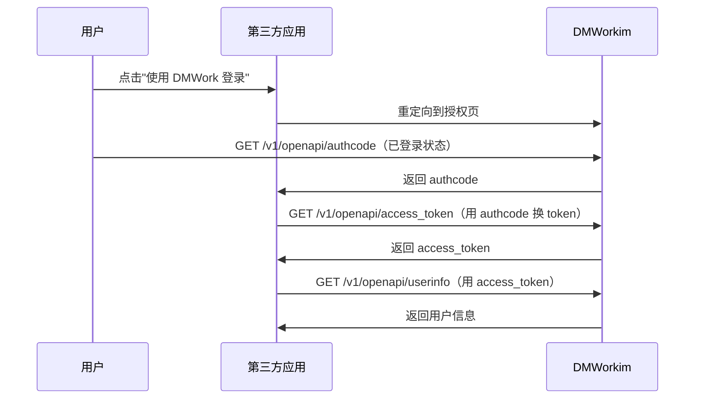

# openapi 模块

## 功能职责

OAuth2 风格的第三方授权接口，允许外部应用获取用户授权、access_token 和用户信息，支持构建 SSO（单点登录）场景。

## API 端点表

| 方法 | 路径 | 描述 | 鉴权 |
|------|------|------|------|
| GET | `/v1/openapi/access_token` | 获取用户 access_token | 无 |
| GET | `/v1/openapi/userinfo` | 获取用户信息 | 无 |
| GET | `/v1/openapi/authcode` | 获取用户授权 authcode | 用户 JWT |

## 授权流程

## 相关模块

- [[user]] — 用户身份认证
- [[common]] — App 配置（RSA 密钥等）

---

## CHANGELOG

| 版本 | 日期 | 作者 | 变更 |
|------|------|------|------|
| 0.1.0 | 2026-03-19 | 戏精 | 初始创建 |
