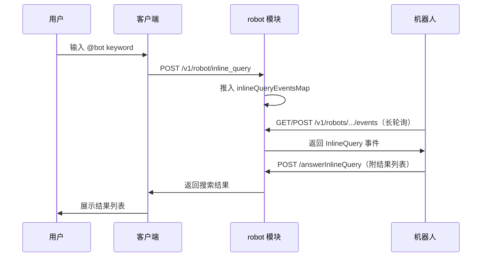

# robot 模块

## 功能职责

Robot 模块是面向**第三方机器人服务**的接入层（区别于 [[botfather|BotFather]] 的 AI Bot 管理），主要提供：
- 机器人菜单同步
- **Inline Query（行内搜索）** — 机器人响应用户 @bot 实时查询
- 机器人命令列表查询
- Bot 简介设置、自动通过好友申请设置
- Bot 广场（Space 内所有 Bot）
- 我的 Bot 列表
- 事件队列（长轮询机制）
- 答复 InlineQuery
- 发送消息、typing、流式消息
- 文件代理下载、上传
- **机器人管理（管理员后台 CRUD）**

## API 端点表

### 用户端接口

| 方法 | 路径 | 描述 | 鉴权 |
|------|------|------|------|
| POST | `/v1/robot/sync` | 同步机器人菜单 | 用户 JWT |
| POST | `/v1/robot/inline_query` | 行内搜索请求 | 用户 JWT |
| GET | `/v1/robot/commands` | 查询命令列表 | 用户 JWT |
| PUT | `/v1/robot/:robot_id/description` | 设置 Bot 简介 | 用户 JWT |
| PUT | `/v1/robot/:robot_id/auto_approve` | 设置自动通过好友申请 | 用户 JWT |
| GET | `/v1/robot/space_bots` | Bot 广场 | 用户 JWT |
| GET | `/v1/robot/my_bots` | 我的 Bot 列表 | 用户 JWT |

### BotFather 申请接口（注册在此模块）

| 方法 | 路径 | 描述 | 鉴权 |
|------|------|------|------|
| POST | `/v1/robot/apply` | Bot 申请加好友 | 用户 JWT |
| POST | `/v1/robot/apply/sure` | 确认 Bot 申请 | 用户 JWT |
| PUT | `/v1/robot/apply/refuse/:apply_id` | 拒绝 Bot 申请 | 用户 JWT |
| GET | `/v1/robot/applies` | Bot 申请列表 | 用户 JWT |

### Robot 认证接口（robot_id + app_key 路径参数）

| 方法 | 路径 | 描述 | 鉴权 |
|------|------|------|------|
| GET | `/v1/robots/:robot_id/:app_key/events` | 获取事件（GET 长轮询） | appKey |
| POST | `/v1/robots/:robot_id/:app_key/events` | 获取事件（POST） | appKey |
| POST | `/v1/robots/:robot_id/:app_key/events/:event_id/ack` | 事件确认 | appKey |
| POST | `/v1/robots/:robot_id/:app_key/answerInlineQuery` | 响应 InlineQuery | appKey |
| POST | `/v1/robots/:robot_id/:app_key/sendMessage` | 发送消息 | appKey |
| POST | `/v1/robots/:robot_id/:app_key/typing` | 输入状态 | appKey |
| POST | `/v1/robots/:robot_id/:app_key/stream/start` | 流式消息开始 | appKey |
| POST | `/v1/robots/:robot_id/:app_key/stream/end` | 流式消息结束 | appKey |
| GET | `/v1/robots/:robot_id/:app_key/file/*path` | 文件代理下载 | appKey |
| POST | `/v1/robots/:robot_id/:app_key/upload` | 文件上传 | appKey |

### 管理员接口

| 方法 | 路径 | 描述 | 鉴权 |
|------|------|------|------|
| GET | `/v1/manager/robot/menus` | 机器人菜单列表 | 管理员 |
| DELETE | `/v1/manager/robot/:robot_id/:id` | 删除机器人菜单 | 管理员 |
| PUT | `/v1/manager/robot/status/:robot_id/:status` | 修改机器人状态 | 管理员 |
| GET | `/v1/manager/robots` | 机器人列表（分页） | 管理员 |
| GET | `/v1/manager/robots/:robot_id` | 机器人详情 | 管理员 |
| PUT | `/v1/manager/robots/:robot_id` | 编辑机器人 | 管理员 |
| DELETE | `/v1/manager/robots/:robot_id` | 删除机器人 | 管理员 |
| POST | `/v1/manager/robots/:robot_id/revoke_token` | 重置 Token | 管理员 |

## 关键数据模型

```go
// 机器人事件
robotEvent {
    EventID     int64
    Message     *config.MessageResp
    InlineQuery *InlineQuery
    EventType   string
    EventData   map[string]interface{}
    Expire      int64
}

// 行内搜索请求
InlineQuery {
    SID, ChannelID string
    ChannelType    uint8
    FromUID        string  // 发送者uid
    Query          string  // 查询关键字
    Offset         string
}

// 消息发送请求
MessageReq {
    Setting     uint8
    ChannelID   string
    ChannelType uint8
    StreamNo    string
    Entities    []*Entitiy  // 消息实体（mention等）
    Payload     map[string]interface{}
}
```

## Inline Query 流程



超时通过配置 `robot.inlineQueryTimeout` 控制（默认 10s）。

## robot 数据库表

| 字段 | 说明 |
|------|------|
| `robot_id` | 机器人 ID（= user.uid） |
| `token` | 传统认证 Token |
| `bot_token` | BotFather Token（`bf_` 前缀） |
| `inline_on` | 是否开启行内搜索 |
| `auto_approve` | 是否自动通过好友申请（默认 0） |
| `creator_uid` | 创建者 uid |
| `bot_commands` | 命令列表 JSON |
| `im_token_cache` | 缓存的 IM Token |

## 相关模块

- [[botfather]] — AI Bot 管理（与 robot 共享申请流程路由）
- [[webhook]] — 消息通知写入 robot_event 表
- [[user]] — robot 本质是特殊 user
- [[space]] — Bot 可以是 Space 成员

## 相关数据库表

- `robot` — 机器人主表
- `robot_menu` — 机器人菜单/命令

---

## CHANGELOG

| 版本 | 日期 | 作者 | 变更 |
|------|------|------|------|
| 0.1.0 | 2026-03-19 | 戏精 | 初始创建，补充管理员 API（8个端点） |
