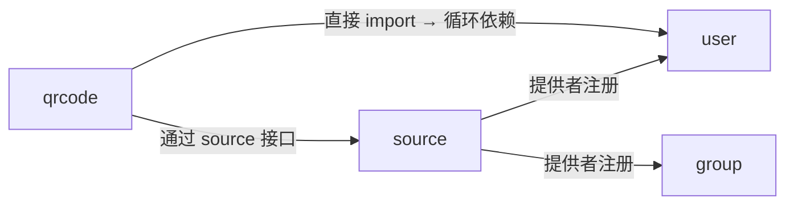

# source 模块

## 功能职责

**跨模块数据提供者（Provider）注册中心**，解决模块间循环依赖问题。

- 定义标准数据提供接口
- 各模块实现接口后注册到 source
- 其他模块通过 source 调用，避免直接 import 导致循环依赖

> ⚠️ **特别说明**：source 是纯 Go 工具包，**没有 `1module.go`，不注册 HTTP 路由**，不在 `internal/modules.go` 的导入列表中。它是 17 个可注册模块之外的内部工具包。

## 设计模式

**接口注册 + 全局变量存储**：

```go
// 接口定义
type IGetGroupMemberProvider interface {
    GetGroupMemberByVercode(vercode string) (*GroupMember, error)
    GetGroupMemberByUID(uid, groupNo string) (*GroupMember, error)
    GetGroupByGroupNo(groupNo string) (*Group, error)
}

type IGetUserProvider interface {
    GetUserByVercode(vercode string) (*User, error)
    GetUserByMailListVercode(vercode string) (*User, error)
    GetUserByQRVercode(vercode string) (*User, error)
    GetUserByUID(uid string) (*User, error)
    GetFriendByVercode(vercode string) (*Friend, error)
}

type IGetInviteCodeProvider interface {
    InviteCoceIsExist(code string) (bool, error)
}

// 注册函数（各模块在 init() 中调用）
SetGroupMemberProvider(provider IGetGroupMemberProvider)
SetUserProvider(provider IGetUserProvider)
SetInviteCodeProvide(provider IGetInviteCodeProvider)
```

## 使用场景

| 调用方 | 通过 source 获取 | 提供方 |
|--------|---------|--------|
| `qrcode` 模块 | 用户信息、群成员信息 | `user` / `group` 模块 |
| `webhook` 模块 | 用户信息（推送内容） | `user` 模块 |

## 解耦示意图



## 相关模块

- [[user]] — 注册 IGetUserProvider
- [[group]] — 注册 IGetGroupMemberProvider
- [[qrcode]] — 使用 source 获取数据
- [[webhook]] — 使用 source 获取数据

---

## CHANGELOG

| 版本 | 日期 | 作者 | 变更 |
|------|------|------|------|
| 0.1.0 | 2026-03-19 | 戏精 | 初始创建 |
