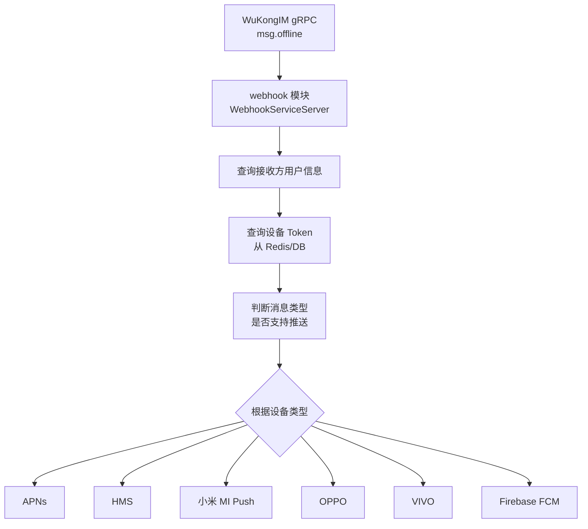

# webhook 模块

## 功能职责

双向 Webhook 枢纽模块：
1. **接收 WuKongIM 下行通知**（gRPC Server）：处理离线消息推送、在线状态变更、全量消息通知
2. **多平台推送分发**：将离线消息转化为各平台推送通知
3. **数据源（Datasource）**：WuKongIM 查询业务数据的回调接口
4. **消息通知接口**：接收 IM 消息通知（HMAC-SHA256 验签）
5. **GitHub Webhook**：处理 GitHub 事件并转化为 IM 消息

## 支持的推送渠道

| 渠道 | 实现文件 | 说明 |
|------|---------|------|
| APNs | `push_iosapns.go` | iOS 苹果推送 |
| HMS | `push_hms.go` | 华为推送 |
| 小米 | `push_mi.go` | 小米推送 |
| OPPO | `push_oppo.go` | OPPO 推送 |
| VIVO | `push_vivo.go` | VIVO 推送 |
| FCM | `push_firebase.go` | Firebase（Android） |

## API 端点表

| 方法 | 路径 | 描述 | 鉴权 |
|------|------|------|------|
| POST | `/v1/webhook` | WuKongIM Webhook 入口（v1） | HMAC 签名 |
| POST | `/v2/webhook` | WuKongIM Webhook 入口（v2） | HMAC 签名 |
| POST | `/v1/datasource` | 数据源查询回调 | HMAC 签名 |
| POST | `/v1/webhook/message/notify` | 消息通知 | HMAC-SHA256 |
| POST | `/v1/webhook/github` | GitHub Webhook | GitHub Secret |

## gRPC 服务

实现 `wkhook.WebhookServiceServer`，启动独立 gRPC Server（`grpcAddr` 可配置，默认 `0.0.0.0:6979`）供 WuKongIM 调用。

### 处理的事件类型

| 事件 | 处理逻辑 |
|------|---------|
| `msg.offline` | 触发推送分发（查设备 Token → 构建 Payload → 分发各厂商） |
| `msg.notify` | 写入消息分片表（message / message1~4）+ 写入 robot_event 表 |
| `user.onlinestatus` | 更新 user_online 表 |

## 推送触发流程



## 推送接口抽象

```go
type Push interface {
    GetPayload(msg msgOfflineNotify, ctx *config.Context, toUser *user.Resp) (Payload, error)
    Push(deviceToken string, payload Payload) error
}

type Payload interface {
    GetTitle() string
    GetContent() string
    GetBadge() int
    GetRTCPayload() RTCPayload  // 音视频呼叫特殊处理
}
```

RTC（音视频）呼叫消息通过 `RTCPayload` 携带呼叫类型和操作，各厂商 SDK 可据此设置高优先级通道。

## 安全签名

```
Header: X-Signature-256: sha256=<hex(HMAC-SHA256(body, secretKey))>
配置项: webhookSecretKey（空字符串=不验证）
```

## 推送内容策略

```go
// push.go: getSupportTypes() 定义支持推送的消息类型
// 支持: 文本、图片、语音、视频、文件、名片、位置、红包通知等

// 内容详情开关
push.contentDetailOn = true   // 推送显示消息预览文字
push.contentDetailOn = false  // 隐私保护，只显示"您有新消息"
```

## 相关模块

- [[base]] — 事件系统（msg.notify 写入 robot_event 后触发事件）
- [[user]] — 查询设备 Token 和用户信息
- [[robot]] — robot_event 表（bot 事件队列）
- [[message]] — 消息分片表写入

---

## CHANGELOG

| 版本 | 日期 | 作者 | 变更 |
|------|------|------|------|
| 0.1.0 | 2026-03-19 | 戏精 | 初始创建 |
