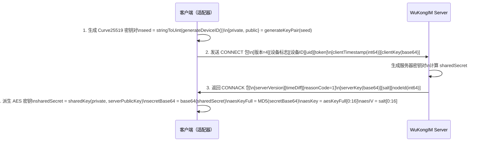

# DH 密钥交换与加密

WuKongIM WebSocket 连接在建立时进行 **Curve25519 ECDH 密钥交换**，派生出 AES-128-CBC 加密密钥，此后所有 RECV 包的 payload 均加密传输。

## 完整握手流程



## 密钥派生详解

```typescript
// Step 1: 生成 Curve25519 密钥对
const seed = stringToUint(generateDeviceID())
const { private: dhPrivate, public: dhPublic } = generateKeyPair(seed)

// Step 2: 发送 clientKey（base64 编码的公钥）

// Step 3: 收到服务器 serverKey 和 salt

// Step 4: 计算 shared secret
const sharedSecret = sharedKey(dhPrivate, serverPublicKey)  // 32 字节

// Step 5: 派生 AES 密钥
const secretBase64 = base64(sharedSecret)
const aesKeyFull = MD5(secretBase64)  // 32 字符十六进制字符串

// Step 6: 截取密钥和 IV
const aesKey = aesKeyFull[0:16]   // 16 字节 AES-128 密钥
const aesIV  = salt[0:16]         // 16 字节 IV（来自服务器返回的 salt）
```

> ⚠️ **CORRECTED（AES IV 条件分支）**：`aesIV = salt[0:16]`。当 `salt.length < 16` 时，需要 padding 处理，不能直接截取。实际实现中需检查 salt 长度：
> ```typescript
> // 当 salt.length < 16 时需要 padding
> const iv = salt.length >= 16 ? salt.slice(0, 16) : salt.padEnd(16, '\0')
> ```

## 关键技术参数

| 参数 | 值 | 说明 |
|------|-----|------|
| 密钥交换算法 | Curve25519 ECDH | `curve25519-js` 库 |
| 密钥派生 | MD5(base64(sharedSecret)) | 取前 16 字节 |
| 加密算法 | AES-128-CBC | 对称加密 |
| 填充方式 | PKCS7 | `crypto-js` 库实现 |
| IV 来源 | salt 前 16 字节（服务器返回） | salt < 16 时 padding |
| 前向安全 | ✅ | 每次连接生成新密钥对 |

## 消息解密（onRecv）

```typescript
// 接收到 RECV 包后
const decrypted = CryptoJS.AES.decrypt(
    CryptoJS.lib.CipherParams.create({
        ciphertext: CryptoJS.enc.Base64.parse(base64EncryptedPayload)
    }),
    CryptoJS.enc.Hex.parse(aesKey),
    {
        iv: CryptoJS.enc.Hex.parse(aesIV),
        mode: CryptoJS.mode.CBC,
        padding: CryptoJS.pad.Pkcs7
    }
)

const payloadStr = CryptoJS.enc.Utf8.stringify(decrypted)
const message = JSON.parse(payloadStr)
```

## 发送消息的加密方式

**发送消息走 REST API，不经过 WebSocket 加密**。只有接收（RECV）的消息 payload 是加密的。

## 库依赖

| 库 | 版本 | 用途 |
|----|------|------|
| `curve25519-js` | ^0.0.4 | Curve25519 ECDH 密钥交换 |
| `crypto-js` | ^4.2.0 | AES-CBC 加解密 |
| `md5-typescript` | ^1.0.5 | shared secret → AES key 派生 |

## 相关页面

- [[WuKongIM二进制协议]] — 协议帧格式
- [[../消息处理/入站与出站]] — 消息处理管道

---

## CHANGELOG

| 版本 | 日期 | 作者 | 变更 |
|------|------|------|------|
| 0.1.0 | 2026-03-19 | 戏精 | 初始创建，修正 AES IV 条件分支（salt < 16） |
