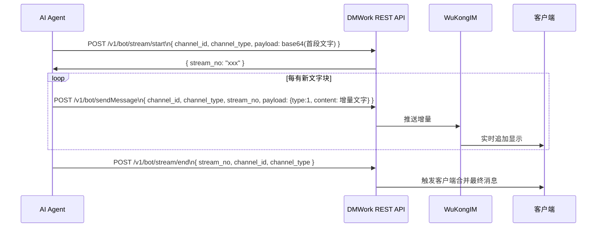

# 流式消息协议

流式消息协议支持 AI 逐字/逐块输出的打字机效果。通过 DMWork REST API 序列实现。

## 流程



## API 端点

| 端点 | 说明 |
|------|------|
| `POST /v1/bot/stream/start` | 开始流式消息，返回 `stream_no` |
| `POST /v1/bot/sendMessage`（含 stream_no） | 发送增量内容 |
| `POST /v1/bot/stream/end` | 结束流式消息 |

> Robot 模块对应端点为：`/v1/robots/:robot_id/:app_key/stream/start` 和 `.../stream/end`

## 降级策略

适配器在以下情况自动降级为普通消息发送：

```typescript
let streamFailed = false

try {
    const { stream_no } = await streamStart(...)
    // 发送增量内容...
    for (const chunk of chunks) {
        await sendMessage({ stream_no, ...chunk })
    }
    await streamEnd(stream_no, ...)
} catch (e) {
    streamFailed = true
}

if (streamFailed) {
    // 降级：发送完整文本作为普通消息
    await sendMessage({ content: fullText })
}
```

## 客户端侧的流式渲染

Web 端（`@dmwork/base`）的流式消息渲染：

```typescript
// MessageWrap 扩展字段
fullStreamContent: string   // 流式消息的完整拼接内容
isStreaming: boolean         // 是否仍在进行中（显示光标动画）
```

TextCell 在渲染时：
- `isStreaming = true`：末尾显示闪烁光标（CSS `wk-stream-cursor` 动画）
- `isStreaming = false`：正常显示最终文本

## 相关页面

- [[WuKongIM二进制协议]] — 底层协议
- [[../消息处理/入站与出站]] — 流式消息的出站处理

---

## CHANGELOG

| 版本 | 日期 | 作者 | 变更 |
|------|------|------|------|
| 0.1.0 | 2026-03-19 | 戏精 | 初始创建 |
