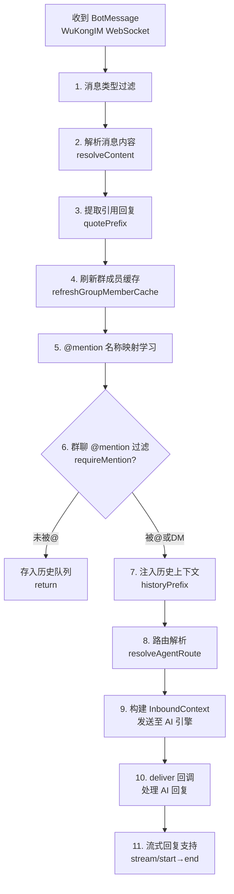

# 入站与出站消息处理

> 适配层消息管道：11 步入站处理流程 + @mention 出站解析。

[[OpenClaw适配器|← OpenClaw适配器]] | [[协议/WuKongIM二进制协议|← WuKongIM 协议]]

## 概述

`dmwork-adapters` 的 `openclaw-channel-dmwork` 包中，`inbound.ts` 是最核心的文件，实现了**从 WuKongIM 收到消息到 AI 引擎处理**的完整管道，以及出站时**@mention 解析和消息发送**的逻辑。

## 入站处理管道（11 步）



### 步骤详解

#### 步骤 1：消息类型过滤

只处理以下类型（其余忽略）：
- `Text`（文本）
- `Image`（图片）
- `Voice`（语音）
- `File`（文件）
- `Video`（视频）
- `GIF`（动图）
- `MultipleForward`（合并转发）

#### 步骤 2：解析消息内容（`resolveContent()`）

| 消息类型 | 处理方式 |
|----------|----------|
| 文本 | 直接返回 `text` |
| 图片/文件/视频 | 构建完整 CDN URL，返回 `text + mediaUrl` |
| 合并转发 | 展开所有内嵌消息为文本 |
| 文本文件 | 尝试读取文件内容并内联到 prompt |

#### 步骤 3：提取引用回复（`quotePrefix`）

从消息的 `reply` 字段中提取被引用消息的摘要，格式化为前缀注入到 AI prompt。

#### 步骤 4：刷新群成员缓存

```typescript
// 缓存 TTL：1 小时
async function refreshGroupMemberCache(groupId: string) {
    if (cacheAge < 3600_000) return  // 未过期，跳过
    
    // 调用 GET /v1/bot/groups/:id/members
    const members = await getGroupMembers(groupId)
    memberCache.set(groupId, { members, ts: Date.now() })
}
```

支持 `stripEmoji` 容错匹配（处理成员名中含 emoji 的情况）。

#### 步骤 5：@mention 名称映射学习

从消息内容的 `@xxx` 与 `mention.uids` 建立 `name → uid` 映射，为后续出站 @mention 解析积累数据。

#### 步骤 6：群聊 @mention 过滤

```typescript
if (account.requireMention && isGroupChannel) {
    const mentioned = message.mention?.uids?.includes(botUID)
    if (!mentioned) {
        // 未被@，只存入历史队列，不触发 AI
        historyQueue.push(message)
        return
    }
}
```

DM（私聊）始终触发 AI，无需 @mention。

#### 步骤 7：历史上下文注入（`historyPrefix`）

```typescript
// 优先使用内存缓存的历史队列（滑动窗口）
// 缓存不足时，从 API 补充：
// POST /v1/bot/messages/sync（CORRECTED: 是 POST，不是 GET）
const messages = await syncMessages({
    channel_id: channelId,
    channel_type: channelType,
    start_message_seq: 0,
    end_message_seq: lastSeq,
    limit: historyLimit  // 默认 20
})
```

> ⚠️ **CORRECTED**：`messages/sync` 端点是 `POST /v1/bot/messages/sync`，不是 GET。

历史以 JSON + 模板格式注入，由 `historyPromptTemplate` 配置控制格式。

#### 步骤 8：路由解析（`resolveAgentRoute()`）

```typescript
// Space 感知：频道 ID 格式 s{spaceId}_{uid}
const { agentId, sessionKey, accountId } = resolveAgentRoute(message)
// sessionKey 包含 spaceId，确保跨 Space 会话隔离
```

#### 步骤 9：构建 InboundContext，发送至 AI

```typescript
const ctx: InboundContext = {
    sessionKey,
    from: sender,
    to: resolveTarget(message),   // "uid123" 或 "group:channelId"
    content: fullContent,
    mediaUrl,
}
await dispatchReplyWithBufferedBlockDispatcher(ctx, runtime)
```

#### 步骤 10：deliver 回调 — AI 回复处理

```typescript
deliver: async (reply: string) => {
    // 1. 解析回复中的 @mentions
    const mentions = parseMentions(reply)
    
    // 2. 构建 mentionUids 数组（保持顺序！）
    const mentionUids = mentions.map(name => nameToUidMap.get(name))
    
    // 3. 未解析的 @name → 强制刷新缓存后重试
    if (mentionUids.includes(undefined)) {
        await refreshGroupMemberCache(groupId, { force: true })
        // 重新解析
    }
    
    // 4. 发送消息
    await sendMessage({ content: reply, mentionUids })
}
```

#### 步骤 11：流式回复支持

```typescript
onPartialReply: async (chunk: string) => {
    if (!streamNo) {
        // 开始流式
        const { stream_no } = await streamStart(channelId, channelType, initialPayload)
        streamNo = stream_no
    }
    // 逐块发送
    await sendMessage({ content: chunk, streamNo })
},
onComplete: async () => {
    // 结束流式
    await streamEnd(streamNo, channelId, channelType)
    // 失败自动降级为普通消息
}
```

## 出站消息处理

### @mention 解析（`mention-utils.ts`）

```typescript
// 匹配 @名字 的正则（支持中英文/点/横线/下划线）
export const MENTION_PATTERN = /@[\w\u4e00-\u9fa5.\-]+/g

// 解析内容中所有 @提及，返回 name 数组（不含@）
export function parseMentions(content: string): string[]

// 提取带@前缀的完整匹配（用于顺序匹配 mention.uids）
export function extractMentionMatches(content: string): string[]
```

**设计要点**：两个函数使用同一正则，确保入站分析和出站生成的 @mention 行为完全一致（修复 issue #31）。

### 消息目标解析

```typescript
// DM（私聊）
ctx.to = "uid123"

// 群组（无@mention）
ctx.to = "group:channelId"

// 群组（带@mention）
ctx.to = "group:channelId@uid1,uid2"
```

### 出站 API 调用

| 函数 | 端点 | 说明 |
|------|------|------|
| `sendMessage()` | `POST /v1/bot/sendMessage` | 发送文本/流式消息 |
| `sendMediaMessage()` | `POST /v1/bot/sendMessage` | 发送媒体消息 |
| `uploadFile()` | `POST /v1/bot/file/upload` | 上传文件 |
| `sendTyping()` | `POST /v1/bot/typing` | 发送输入状态 |
| `streamStart()` | `POST /v1/bot/stream/start` | 开始流式 |
| `streamEnd()` | `POST /v1/bot/stream/end` | 结束流式 |

### sendMessage Payload 结构

```typescript
interface SendMessageReq {
    channel_id:   string          // 目标频道 ID
    channel_type: number          // 1=DM 2=Group
    payload: {
        type:        number       // ContentType（1=文本）
        content:     string       // 消息内容
        mention_uids?: string[]   // @mention 用户 UID 列表
        mention_all?: boolean     // @所有人
    }
    stream_no?: string            // 流式消息序号
}
```

## 群聊历史滑动窗口

```
消息队列（内存，按 groupId 分组）

时间线：  M1 → M2 → M3 → ... → M20 → M21（被@Bot）
窗口大小：                ← 20条（historyLimit）→
           ↑ 滑出                           ↑ 最新

被@时：将这 20 条历史注入 AI prompt
不清空：队列持续滑动，保持连续上下文
```

## Space 隔离机制

频道 ID 格式：

```
普通频道：  {peer_uid}
Space频道： s{space_id}_{peer_uid}
```

适配器解析 `spaceId` 并将其纳入 `sessionKey`，确保同一用户在不同 Space 的 AI 会话相互隔离。

## 相关页面

- [[OpenClaw适配器|05-适配层/OpenClaw适配器]]
- [[Claude-Code适配器|05-适配层/Claude-Code适配器]]
- [[流式消息协议|05-适配层/协议/流式消息协议]]
- [[Bot-API|08-API参考/Bot-API]]
- [[概述|05-适配层/概述]]

## CHANGELOG

| 版本 | 日期 | 变更 |
|------|------|------|
| 0.1.0 | 2026-03-19 | 初始版本；CORRECTED: messages/sync 为 POST |
