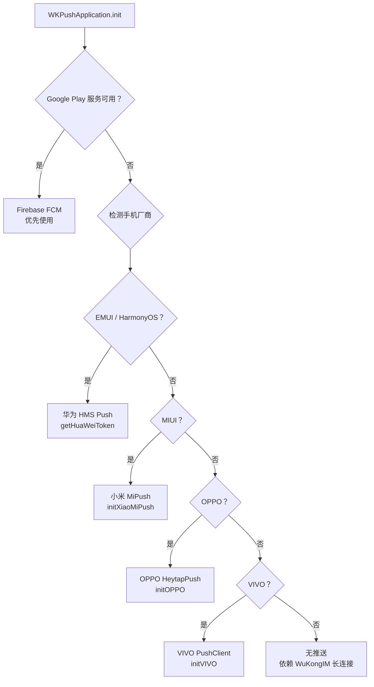

# Android 推送系统

> 5 大厂商推送全覆盖：MI · HMS · VIVO · OPPO · Firebase FCM，智能选路策略。

[[概述|← Android 概述]] | [[推送系统（服务端）|02-架构/横切关注点/推送系统]]

## 概述

`wkpush` 模块（`com.chat.push`）实现了 Android 端的多厂商推送策略。由于国内 Android 生态的特殊性（大部分设备没有 Google Play 服务），DMWork 接入了 5 家主流厂商的推送 SDK，通过运行时检测自动选择合适的推送通道。

## 推送选路策略



**厂商检测工具类**：

```java
OsUtils.isEmui()  // 华为/荣耀设备（EMUI/HarmonyOS）
OsUtils.isMiui()  // 小米设备（MIUI）
OsUtils.isOppo()  // OPPO/一加设备
OsUtils.isVivo()  // VIVO/iQOO 设备
```

## 5 大推送平台详解

### 1. Firebase FCM（Google 通道）

| 项目 | 详情 |
|------|------|
| 模块依赖 | `com.google.firebase:firebase-messaging` |
| BOM 版本 | `com.google.firebase:firebase-bom:32.8.1` |
| 接收类 | `WKFirebaseMessagingService` |
| 适用场景 | Google Play 服务可用的设备（海外 / 国内 GMS 手机） |
| Token 获取 | `FirebaseMessaging.getInstance().getToken()` |

```java
// WKFirebaseMessagingService.java
@Override
public void onMessageReceived(RemoteMessage remoteMessage) {
    // 解析 payload（消息摘要/发送者/channelID）
    // 展示本地通知（NotificationCompat.Builder）
    // 点击通知 → 跳转 MainActivity
}

@Override
public void onNewToken(String token) {
    // 上传新 token 到 dmworkim
    PushModel.registerDeviceToken(token, bundleId, "firebase")
}
```

### 2. 华为 HMS Push

| 项目 | 详情 |
|------|------|
| 模块依赖 | `com.huawei.hms:push:6.1.0.300` |
| 接收类 | `HuaweiHmsMessageService` |
| 适用场景 | 华为/荣耀设备（EMUI / HarmonyOS，无 GMS） |
| Token 获取 | `HmsInstanceId.getInstance().getToken(appId, "HCM")` |

```java
// HuaweiHmsMessageService.java
@Override
public void onMessageReceived(RemoteMessage message) {
    // 类似 FCM，解析推送内容并展示通知
}

@Override
public void onNewToken(String token) {
    PushModel.registerDeviceToken(token, bundleId, "hms")
}
```

**注意**：HMS 需要在华为开发者中心配置 `agconnect-services.json`，并在 `build.gradle` 中引入 HMS Core 插件。

### 3. 小米 MiPush

| 项目 | 详情 |
|------|------|
| 模块依赖 | `files('libs/MiPush_SDK_Client_3_7_5.jar')` |
| 接收类 | `XiaoMiMessageReceiver` |
| 适用场景 | MIUI 系统设备（小米/红米） |
| 注册方式 | `MiPushClient.registerPush(context, appId, appKey)` |

```java
// XiaoMiMessageReceiver.java（继承 PushMessageReceiver）
@Override
public void onReceiveRegisterResult(Context context, MiPushCommandMessage message) {
    String regId = message.getResultList().get(0);
    PushModel.registerDeviceToken(regId, bundleId, "mi")
}

@Override
public void onReceivePassThroughMessage(Context context, MiPushMessage message) {
    // 处理透传消息（不显示通知栏，直接给 App 处理）
}
```

**优势**：MIUI 系统级接入，推送到达率高，App 未运行时也能收到推送。

### 4. OPPO 推送（HeytapPush）

| 项目 | 详情 |
|------|------|
| 模块依赖 | `project(path: ':MyLibs:oppopush')` (push-3.0.0.aar) |
| 接收类 | `OPPOPushMessageService` + `OPPOAppPushMessageService` |
| 适用场景 | OPPO/一加/Realme 设备（ColorOS） |
| 注册方式 | `HeytapPushManager.init(context, true)` |

```java
// OPPOPushMessageService.java
@Override
public void onRegister(int responseCode, String registerID) {
    if (responseCode == ICallBackResultService.SUCCESS) {
        PushModel.registerDeviceToken(registerID, bundleId, "oppo")
    }
}

@Override
public void onNotificationClicked(Context context, String[] notificationId) {
    // 通知点击处理
}
```

**注意**：OPPO 推送需要在 OPPO 开放平台申请权限，有内容审核流程。

### 5. VIVO 推送

| 项目 | 详情 |
|------|------|
| 模块依赖 | `project(path: ':MyLibs:vivopush')` (VIVO push AAR) |
| 接收类 | `VivoPushMessageReceiverImpl` |
| 适用场景 | VIVO/iQOO 设备（OriginOS / FuntouchOS） |
| 注册方式 | `PushClient.getInstance(context).initialize()` |

```java
// VivoPushMessageReceiverImpl.java（继承 OpenClientPushMessageReceiver）
@Override
public void onReceiveRegId(Context context, String regId) {
    PushModel.registerDeviceToken(regId, bundleId, "vivo")
}

@Override
public void onNotificationMessageClicked(Context context, UPSNotificationMessage message) {
    // 通知点击跳转
}
```

**注意**：VIVO 推送需申请消息分类（运营消息/系统消息），影响推送优先级。

## Token 注册与服务端同步

获取 token 后统一调用：

```java
// PushModel.java / PushService.java
public static void registerDeviceToken(String token, String bundleId, String pushType) {
    // POST /v1/user/device_token
    Map<String, Object> params = new HashMap<>();
    params.put("device_token", token);
    params.put("bundle_id", bundleId);
    params.put("device_flag", 2);       // 2 = Android
    params.put("push_type", pushType);  // "firebase"|"mi"|"hms"|"vivo"|"oppo"
    
    WKApiConfig.apiClient.post("/v1/user/device_token", params, ...);
}
```

## 推送 Payload 结构

```json
{
  "title": "张三",
  "body": "你好！",
  "channel_id": "s1001_uid001",
  "channel_type": 2,
  "badge": 3
}
```

## AndroidManifest 配置要点

```xml
<!-- Firebase -->
<service android:name=".push.WKFirebaseMessagingService"
         android:exported="false">
    <intent-filter>
        <action android:name="com.google.firebase.MESSAGING_EVENT"/>
    </intent-filter>
</service>

<!-- 小米推送 -->
<receiver android:name=".push.XiaoMiMessageReceiver"
          android:exported="true">
    <intent-filter>
        <action android:name="com.xiaomi.mipush.RECEIVE_MESSAGE"/>
        <action android:name="com.xiaomi.mipush.MESSAGE_ARRIVED"/>
        <action android:name="com.xiaomi.mipush.ERROR"/>
    </intent-filter>
</receiver>

<!-- 华为 HMS -->
<service android:name=".push.HuaweiHmsMessageService"
         android:exported="false">
    <intent-filter>
        <action android:name="com.huawei.push.action.MESSAGING_EVENT"/>
    </intent-filter>
</service>
```

## 与服务端推送的协作

```
App 后台时收到推送：

厂商推送通道（MI/HMS/OPPO/VIVO/FCM）
    → Receiver/Service
    → 解析 payload（消息摘要/发送者）
    → 展示系统通知（NotificationCompat）

用户点击通知：
    → MainActivity（from=notification extra）
    → 路由到对应会话（ChatActivity）
    → 连接 WuKongIM 拉取完整消息
```

## 服务端对应文档

服务端推送分发逻辑参见 [[推送系统|02-架构/横切关注点/推送系统]]（webhook 模块的 6 平台实现）。

## 相关页面

- [[概述|06-客户端/Android/概述]]
- [[推送系统（服务端）|02-架构/横切关注点/推送系统]]
- [[故障排查|10-运维/故障排查]]

## CHANGELOG

| 版本 | 日期 | 变更 |
|------|------|------|
| 0.1.0 | 2026-03-19 | 初始版本，基于 wkpush 模块源码分析 |
