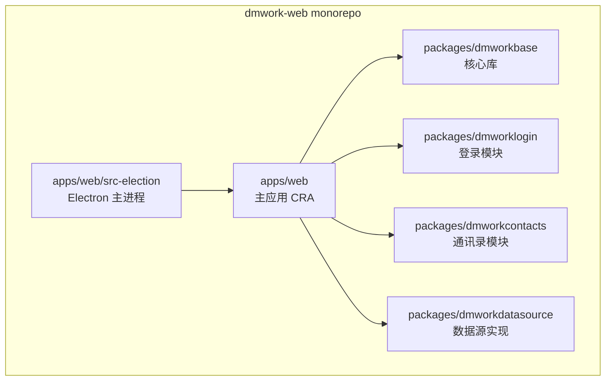

# DMWork Web 客户端概述

> React + TypeScript 的企业 IM 客户端，同时交付 Web 浏览器和 Electron 桌面端。

[[概述|← 客户端概述]] | [[组件与消息渲染|组件与消息渲染 →]] | [[Service层与Space|Service 层与 Space →]]

## 概述

`dmwork-web` 是 DMWork 的 Web/PC 客户端，基于 **Turborepo monorepo** 组织，版本 `v1.5.0`。同一套 React 代码库通过两种方式交付：

1. **Web 浏览器**：标准 React SPA（CRA + react-app-rewired）
2. **Electron 桌面端**：macOS / Windows / Linux 原生应用



## Turborepo Monorepo 结构

```
dmwork-web/
├── apps/
│   └── web/                     # 主应用
│       ├── src/                 # React 入口、布局、页面
│       │   ├── index.tsx        # CRA 入口
│       │   └── App.tsx          # 应用根组件（注册路由/菜单）
│       └── src-election/        # Electron 主进程
│           ├── main/index.ts    # BrowserWindow、Tray、快捷键
│           └── preload/         # 预加载脚本（ipcRenderer 桥）
├── packages/
│   ├── dmworkbase/              # ★ 核心库（所有包都依赖）
│   ├── dmworkcontacts/          # 通讯录模块
│   ├── dmworkdatasource/        # 数据源实现层
│   ├── dmworklogin/             # 登录/注册/找回密码
│   ├── eslint-config-custom/    # 共享 ESLint 配置
│   └── tsconfig/                # 共享 TypeScript 配置
├── e2e/                         # Playwright E2E 测试
├── turbo.json                   # Turborepo 任务配置
└── package.json                 # 根 workspace（Yarn 1.22.19）
```

## 六个包的职责

| 包 | npm 名称 | 职责 |
|----|----------|------|
| `dmworkbase` | `@dmwork/base` | ★ 核心库：WKApp 单例、组件、消息渲染、主题 Token、服务层 |
| `dmworklogin` | `@dmwork/login` | 登录/注册/OAuth/扫码登录、密码找回 |
| `dmworkcontacts` | `@dmwork/contacts` | 通讯录、添加好友、群组、黑名单 |
| `dmworkdatasource` | `@dmwork/datasource` | 数据源具体实现（接口由 base 定义，这里实现） |
| `eslint-config-custom` | — | 共享 ESLint 规则 |
| `tsconfig` | — | 共享 TypeScript 配置（base/react/nextjs） |

### 依赖方向（单向严格）

```
apps/web
  ↓
dmworklogin / dmworkcontacts / dmworkdatasource
  ↓
dmworkbase   ← 核心，不依赖任何业务包
```

## Token 主题系统

DMWork Web 采用 **CSS 变量 Token 系统**（`tokens.css` + `tokens.ts` 双轨），规范来自 `AGENTS.md`：

| 规则 | 说明 |
|------|------|
| **禁止硬编码颜色** | 所有颜色必须用 `var(--wk-brand-*)` 等变量 |
| **禁止硬编码间距** | 使用 4px 栅格 `var(--wk-sp-1)` ~ `var(--wk-sp-12)` |
| **禁止硬编码圆角** | 使用 `var(--wk-r-xs)` ~ `var(--wk-r-full)` |
| **人类头像** | `border-radius: 50%`（`--wk-r-full`，圆形） |
| **AI Bot 头像** | `border-radius: var(--wk-r-sm)`（6px，方形区分） |
| **群组头像** | `border-radius: var(--wk-r-md)`（10px） |

**品牌色**：紫色（`#7C5CFC`）→ 青色（`#00D4AA`）渐变，象征 "AI ↔ Human 的光谱"。

**暗色模式**：通过 `body[theme-mode=dark]` 属性切换，无需 `@media` 查询，`WKConfig.themeMode` setter 操作 DOM attribute。

## 构建流水线

```
Turborepo 构建顺序：
packages/*/build     → 各包编译
apps/web/build       → CRA 打包 Web
compile:electron     → TypeScript 编译主进程
electron-builder     → 打包安装包（.dmg/.exe/.deb）
```

多平台构建命令：

| 命令 | 目标 |
|------|------|
| `yarn build` | Web SPA |
| `yarn build-ele:mac` | macOS `.dmg` |
| `yarn build-ele:win` | Windows `.exe` |
| `yarn build-ele:linux` | Linux `.AppImage` |
| `yarn build-ele:linux-arm64` | Linux ARM64 |

## Electron 桌面端特性

`apps/web/src-election/main/index.ts` 实现：

- **BrowserWindow 管理**：主窗口创建、最小化、最大化
- **系统托盘（Tray）**：后台运行，右键菜单
- **全局快捷键**：截图、切换会话
- **ipcMain 消息桥**：截图、未读数徽章、重启更新
- **electron-updater**：自动检查更新、后台下载、重启安装
- **Tauri 兼容**：`/v1/common/updater/:os/:version` 端点兼容 Tauri 桌面端

## 运行时架构

```
Browser / Electron WebView
    │
    ├── index.tsx（CRA 入口）
    │     └── App.tsx（注册菜单、路由）
    │           └── AppLayout（Provider 根）
    │                 ├── SpaceGate（Space 鉴权门卫）
    │                 └── WKBase（全局弹窗宿主）
    │                       └── MainPage（三栏布局）
    │                             ├── SpaceList（左侧 Space 切换）
    │                             ├── ConversationList（会话列表）
    │                             └── ChatPage / ContactsList / BotStore
    │
    └── Electron Main Process（src-election/main/index.ts）
          ├── BrowserWindow 管理
          ├── Tray 系统托盘
          └── electron-updater 自动更新
```

## 技术栈速查

| 层次 | 技术选型 |
|------|----------|
| 框架 | React 18（CRA + react-app-rewired） |
| 语言 | TypeScript（严格模式） |
| 状态管理 | 自研 Provider + ProviderListener（无 Redux/MobX） |
| HTTP | axios（封装为 APIClient） |
| IM SDK | wukongim-js-sdk（WuKongIM 官方） |
| 桌面端 | Electron（electron-builder 打包） |
| 构建 | Turborepo + Yarn Workspaces |
| UI 组件库 | Semi Design（`@douyinfe/semi-ui`） |
| 虚拟列表 | react-virtuoso（消息列表） |
| E2E 测试 | Playwright |

## 相关页面

- [[概述|06-客户端/概述]]
- [[组件与消息渲染|06-客户端/Web/组件与消息渲染]]
- [[Service层与Space|06-客户端/Web/Service层与Space]]
- [[编码规范|03-开发指南/编码规范]]

## CHANGELOG

| 版本 | 日期 | 变更 |
|------|------|------|
| 0.1.0 | 2026-03-19 | 初始版本，基于 project_dmwork_web.md 深度分析 |
