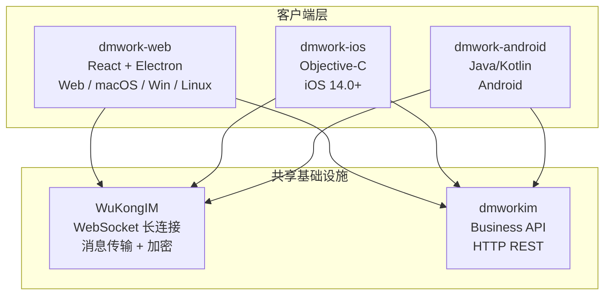

# 客户端概述

> DMWork 三端客户端的全景对比与共性模式。

## 概述

DMWork 提供三个原生客户端，覆盖全部主流平台：



## 三端对比

| 维度 | Web（dmwork-web） | iOS（dmwork-ios） | Android（dmwork-android） |
|------|-------------------|-------------------|--------------------------|
| **语言** | TypeScript / React | Objective-C | Java / Kotlin |
| **版本要求** | - | iOS 14.0+ | Android 5.0+ |
| **包管理** | Yarn + Turborepo | CocoaPods | Gradle |
| **架构模式** | Provider + EndpointManager | MVVM + EndpointManager | MVVM + EndpointManager |
| **网络层** | axios + WuKongIM JS SDK | AFNetworking + PromiseKit | Retrofit2 + RxJava3 |
| **IM SDK** | wukongim-js-sdk | WuKongIMiOSSDK | WuKongIMAndroidSDK 1.4.7 |
| **推送** | Web Notification API | APNs | 6 厂商（MI/HMS/VIVO/OPPO/FCM + Bugly） |
| **桌面端** | Electron（macOS/Win/Linux） | - | - |
| **主题系统** | CSS Token + 暗色模式 | 系统主题适配 | 系统主题适配 |
| **历史品牌** | - | LiMaoIMDemo（productName 遗留） | TsddClient（rootProject.name 遗留） |
| **规模** | 15MB, 6包 | 120MB | 139MB |

## 共性架构模式

### 1. EndpointManager — 模块解耦总线

三端都采用 **EndpointManager** 模式实现模块间解耦：

```
模块 A                          模块 B
注册端点:                       调用端点:
endpointManager.set(            endpointManager.invoke(
  "feature_name",                 "feature_name", args
  handler                       )
)
```

这使得各业务模块（登录、通讯录、聊天 UI）可以独立开发，通过端点名称互相通信，避免直接 import 依赖。

### 2. WuKongIM SDK — 统一通讯底座

三端都通过 WuKongIM 官方 SDK 处理底层通讯：

```
客户端 App
    │
    ▼
WuKongIM SDK（各平台原生实现）
    │ WebSocket（自定义二进制协议）
    │ DH 密钥交换 + AES 加密
    ▼
WuKongIM 服务器
    │ gRPC Webhook
    ▼
dmworkim（业务层）
```

### 3. APIClient — 统一 HTTP 客户端

各端都有封装好的 `APIClient`（或等效封装），负责：
- 注入 `Authorization: Bearer {token}` 请求头
- 统一 401 处理（自动登出）
- 统一错误消息透传
- API 基础 URL 动态配置（支持私有化部署）

### 4. Space 感知 — 多租户支持

三端均支持 Space 多租户模式：
- Space 切换后重新加载联系人、群组、会话列表
- 频道 ID 格式：`s{space_id}_{peer_uid}`（Space 前缀隔离）
- 新用户加入 Space 时自动加入预设群组

## 功能覆盖矩阵

| 功能 | Web | iOS | Android |
|------|-----|-----|---------|
| 单聊/群聊 | ✅ | ✅ | ✅ |
| 图片/文件/语音 | ✅ | ✅ | ✅ |
| @mention | ✅ | ✅ | ✅ |
| 消息撤回/编辑 | ✅ | ✅ | ✅ |
| 合并转发 | ✅ | ✅ | ✅ |
| 端到端加密（Signal） | ✅ | ✅ | ✅ |
| AI Bot 流式消息 | ✅ | ✅ | ✅ |
| Space 工作空间 | ✅ | ✅ | ✅ |
| 扫码登录 | ✅ | ✅ | ✅ |
| 视频通话（RTC） | ✅ | 🔶 | 🔶 |
| 离线推送 | Web Push | APNs | 多厂商 |
| 桌面端 | Electron | - | - |
| 深色模式 | ✅ | ✅ | ✅ |

> 🔶 = 部分支持 / 需要第三方 RTC SDK

## 相关页面

- [[Web/概述|06-客户端/Web/概述]]
- [[iOS/概述|06-客户端/iOS/概述]]
- [[Android/概述|06-客户端/Android/概述]]
- [[05-适配层/概述|05-适配层/概述]]
- [[架构概述|02-架构/架构概述]]

## CHANGELOG

| 版本 | 日期 | 变更 |
|------|------|------|
| 0.1.0 | 2026-03-19 | 初始版本，整合三端 summary 分析 |
