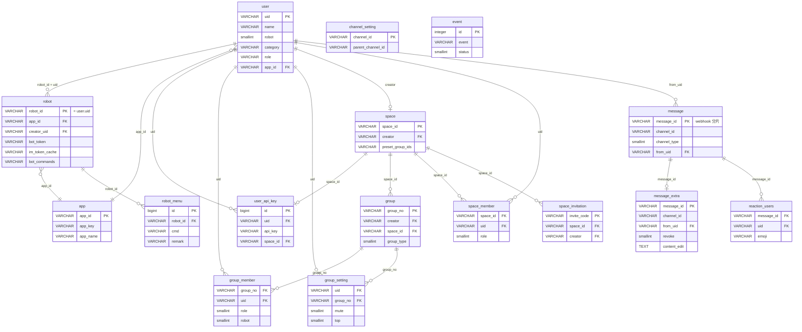
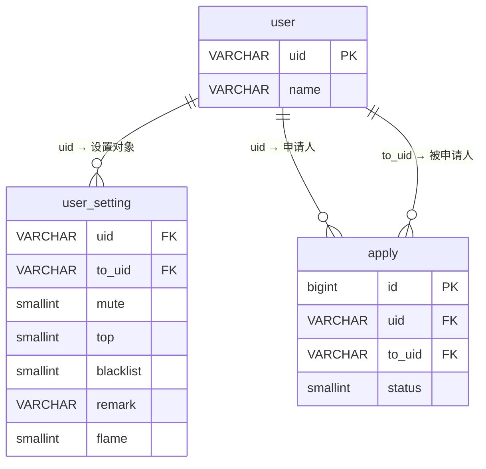

# 表关系图（ER Diagram）

[[概览|← 返回概览]]

## 核心关系图



## 关键关系说明

### Bot = 特殊 User

Bot（机器人）在系统中是 `user` 表中 `robot = 1` 的特殊用户：

```
user.uid → robot.robot_id（一对一）
user.robot = 1（标记为机器人）
user.app_id → app.app_id（所属 App）
robot.creator_uid → user.uid（Bot 的创建者）
```

### Space 多租户隔离

```
space
  ├── space_member（成员体系）
  │     └── role: 0=成员, 1=管理员, 2=拥有者
  ├── group.space_id（群组归属）
  └── space_invitation（邀请系统）
```

### 消息分片

```
webhook 模块（message, message1~4）
  └── 按 message_id % 5 路由
      └── 每张表结构完全相同
```

### Channel 关系

Channel 不是独立的表，而是通过 `(channel_id, channel_type)` 复合键在各表中引用：

```
channel_type:
  1 = 个人频道（DM）
  2 = 群组频道
  3 = 客服频道
  5 = 社区频道
  6 = 话题频道（带 parent_channel_id）
```

## 用户与好友关系



`user_setting` 是用户关系的核心表（每对用户关系一条记录），包含：
- 好友关系（通过是否存在记录判断）
- 黑名单（`blacklist = 1`）
- 免打扰、置顶等个性化设置
- 阅后即焚设置（`flame`, `flame_second`）

---

## 相关文档

- [[概览]] — 数据库整体概览
- [[表结构详情]] — 完整字段定义
- [[消息分片设计]] — 分片策略详解
- [[Bot数据模型]] — Bot 相关表

---

## CHANGELOG

| 版本 | 日期 | 变更 |
|------|------|------|
| 0.1.0 | 2026-03-19 | 初稿，Mermaid ER 图 |
