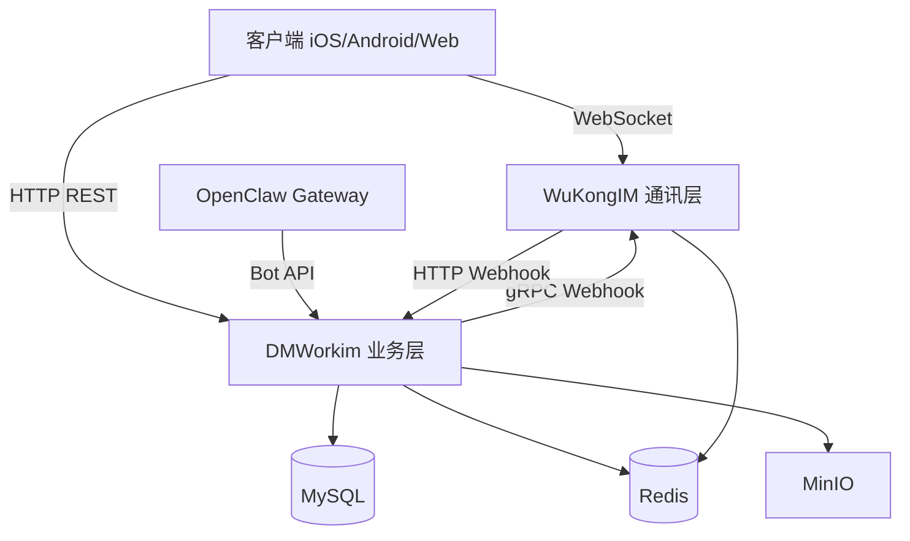

# 部署架构

Octo 平台由多个服务组成，通过 Docker Compose 编排部署。

## 服务总览

```
Octo 平台
├── dmworkim（业务逻辑层，Go）
│     ├── API 服务（HTTP :8080）
│     └── gRPC Webhook 服务（:8081）
├── WuKongIM（底层通讯层）
│     ├── WebSocket 服务（:5200）
│     ├── HTTP API（:5001）
│     └── Webhook Caller
├── MySQL（:3306）
├── Redis（:6379）
└── MinIO（:9000 / :9001）
      ├── Object Storage API（:9000）
      └── Console UI（:9001）
```

## 服务依赖图



## 网络端口

| 服务 | 端口 | 协议 | 说明 |
|------|------|------|------|
| dmworkim API | 8080 | HTTP | 业务 REST API |
| dmworkim gRPC | 8081 | gRPC | WuKongIM Webhook 接收 |
| WuKongIM WS | 5200 | WebSocket | 客户端长连接 |
| WuKongIM HTTP | 5001 | HTTP | WuKongIM 管理/API |
| MySQL | 3306 | TCP | 数据库 |
| Redis | 6379 | TCP | 缓存 |
| MinIO API | 9000 | HTTP | 对象存储 |
| MinIO Console | 9001 | HTTP | MinIO 管理界面 |

## 环境分类

### Dev（开发/测试）

```
IM 地址：im-test.deepminer.com.cn
API 地址：https://im-test.deepminer.com.cn
```

### Prod（生产）

```
IM 地址：im.deepminer.com.cn
API 地址：https://im.deepminer.com.cn
```

（来源：dmwork-android `productFlavors` 配置）

## 双层架构

```
┌─────────────────────────────────────────────────────┐
│           DMWorkim（业务逻辑层）                       │
│  用户管理 · 群组管理 · 机器人 · 工作台 · 推送 · 文件  │
└─────────────────────────┬───────────────────────────┘
                          │ HTTP API / gRPC Webhook
┌─────────────────────────▼───────────────────────────┐
│           WuKongIM（底层通讯层）                       │
│    WebSocket 长连接 · 消息存储 · 频道管理 · 路由       │
└─────────────────────────────────────────────────────┘
```

**设计原则**：
- 通讯协议复杂性（连接管理、消息路由、离线队列）由 **WuKongIM** 承担
- 业务逻辑（用户身份、群组权限、机器人事件）由 **DMWorkim** 承担
- 两层通过 HTTP API（上行）和 gRPC Webhook（下行通知）交互

## 相关文档

- [[Docker配置]] — Docker Compose 配置详情
- [[故障排查]] — 常见问题与解决方案

---

## CHANGELOG

| 版本 | 日期 | 变更 |
|------|------|------|
| 0.1.0 | 2026-03-19 | 初稿 |
